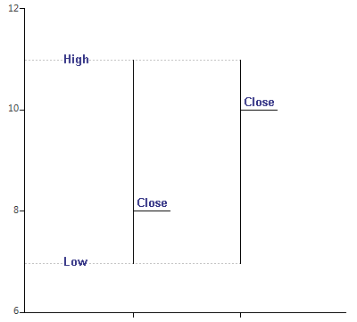
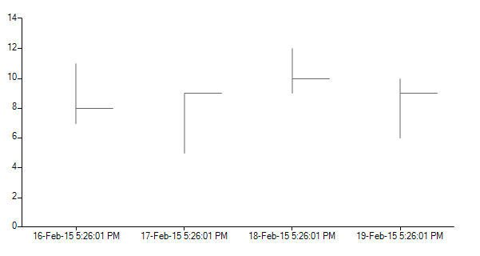

# Hlc

The __Hlc series__ is a simple variant of the [Ohlc series]() which was discussed in the previous topic. Its data points contain information about the following parameters: * high*, *low* and *close*.

Here is how to read the values of an __Hlc__ point:

|  __Hlc__  |
| ------ |
||

Here is how to setup the __Hlc__ series: 

#### Initial Setup

<snippet id='chartview-hlc-hlc-cs'/>
<snippet id='chartview-hlc-hlc-vb'/>

>caption Figure 1: Initial Setup 

# See Also

* [Series Types]()
* [Populating with Data]()
