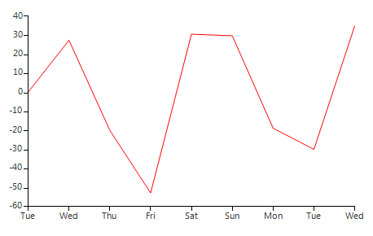
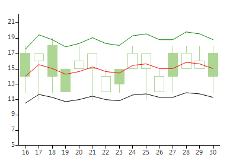

# Custom Indicators

This article aims to demonstrate how to create indicators that use custom built-in formulas. The first indicator to be set up is __Disparity Index indicator__ and second is a __two-line Moving Average Envelopes indicator__.

## Disparity Index (DI)

__Disparity Index (DI)__ indicator is described by its creator Steve Nison as *"a percentage display of the latest close to a chosen moving average"*. A generalized formula of the DI can be defined as follows:

DI = ((CurrentClose – MA) / MA) * 100

The __MA__ notation in the above formula stands for any __Moving Average__ indicator. This example will use __Exponential Moving Average__, so the formula will be rather:

DI = ((CurrentClose - EMA) / EMA) * 100

The formula suggests that __DI__ needs to use the calculations of the __EMA__ indicator and the closing price value coming from the data source. To achieve the desired outcome we will need to (1) create a class that inherits __EMA__, and (2) override the __GetProcessedValue__ method to return the modified value. The __CurrentClose__ value in the formula can be drawn from the __BaseValue__ property of the current indicator’s data point. All __Moving Average indicators__ use data points of type __IdicatorValueDataPoint__. Specifically designed to work with indicators, these data points contain a field called __BaseValue__ which is indeed the unprocessed value fetched from the data source. 

Now that we have all variables from the formula above, let us start constructing our indicator. First, create a class __DisparityIndexIndicator__ that inherits __ExponantialMovingAverage__ and override the __GetProcessedValue__ method. The method has a parameter *currentIndex*, which allows you to extract the reach the current data point and extract its __BaseValue__. To get the __EMA calculated value__, use the base __GetProcessedValue__ method. The only step left is to calculate and return the modified value. Here is how your code should look like: 

#### DI Indicator

<snippet id='chartview-custom-indicators-diindicator-cs'/>
<snippet id='chartview-custom-indicators-diindicator-vb'/>

Now let’s create a new __DI__ indicator instance and add it to our __RadChartView__. In order to do that, however, we will need some sample data. The snippet below creates a __BindingList__ of __ClosingPriceObjects__. Each __ClosingPriceObject__ is a simple structure that holds the closing price and date it was registered. The class implements __INotifyPropertyChanged__ in order to make sure that any changes in the object's data will be reflected in the indicator’s values. 

>caption Figure 1: DI Indicator

#### Custom Object

<snippet id='chartview-custom-indicators-customobject-cs'/>
<snippet id='chartview-custom-indicators-customobject-vb'/>

#### Create Data

<snippet id='chartview-custom-indicators-createdata-cs'/>
<snippet id='chartview-custom-indicators-createdata-vb'/>

#### SetupDIIndicator

<snippet id='chartview-custom-indicators-setupdiindicator-cs'/>
<snippet id='chartview-custom-indicators-setupdiindicator-vb'/>

## Moving Average Envelopes (MAE) 

__Moving Average Envelopes (MAE)__ is a slightly more complex indicator as it contains two bands, frequently referred to as __Envelopes__. The indicator uses __Simple Moving Average__ as a starting point and shifts its two bands upwards and downwards to form the envelopes above and below the moving average. The percentage formula used to calculate the envelopes is:

UpperEnvelope = MA + (U% * MA)    

LowerEnvelope = MA + (L% * MA)    

Where U% is the Upper Percentage and L% is the lower percentage    

All two-line indicators in RadChartView follow a specific pattern – the main indicator implements the __IParentIndicator__ interface and the nested indicator implements the __IChildIndicator__ interface. Once you have implemented these two interfaces, RadChartView will be in charge of attaching and rendering the two lines correctly.

>caption Figure 2: Moving Average indicator
        

Because __Moving Average Envelopes__ requires a property that sets the bands percent (assuming that both bands will use the same percent), we will create a __MAE__ base that inherits the __Moving Average indicator__and adds a __Percent__ property. Here is a sample snippet: 

#### Base Class

<snippet id='chartview-custom-indicators-maebase-cs'/>
<snippet id='chartview-custom-indicators-maebase-vb'/>

Let’s now create two classes: __MovingAverageEnvelopeChild__, containing the lower band’s logic and __MovingAverageEnvelopeIndicator__, holding the upper band’s formula. They should both inherit __MovingAverageEnvelopeBase__ class. Here are the steps that set up the __MovingAverageEnvelopeChild__ class, first, make sure the __MovingAverageEnvelopeChild__ class implements the __IChildIndicator__ interface. Further, add a field that holds the parent indicator and use it when implementing the __OwnerIndicator__ property. Also, override the __GetProcessedValue__ method and use the __Percent__ property to calculate the correct lower envelope value. Here is a sample snippet of the __MovingAverageEnvelopeChild__: 

#### Child Class

<snippet id='chartview-custom-indicators-maechild-cs'/>
<snippet id='chartview-custom-indicators-maechild-vb'/>

The __MovingAverageEnvelopeIndicator__ class requires a bit more steps that the indicator child. First, make the class implement the __IParentIndicator__ interface. Create a field of type __MovingAverageEnvelopeChild__, initialize it in the indicator’s constructor, and return it when implementing the __ChildIndicator__ property. To make sure the inner indicator will be attached and detached, override both __OnAttached__ and __OnDettached__ methods and manually attach and detach the __ChildIndicator__. To ensure the inner indicator will be bound properly, override the __OnNotifyPropertyChanged__ method and pass any important property values to the child indicator. Here is a sample snippet: 

#### MAE Indicator

<snippet id='chartview-custom-indicators-maeindicator-cs'/>
<snippet id='chartview-custom-indicators-maeindicator-vb'/>

Now that we have the __MovingAverageEnvelopeIndicator__ ready, let us set up some sample data and see how it looks like. The following snippet uses __BindingList__ of custom __OhlcObjects__. For the sake of presentation, this example adds __OhlcSeries__ and a simple __Moving Average indicator__ next to the __MovingAverageEnvelopeIndicator__. 

#### Create and Setup Indicator

<snippet id='chartview-custom-indicators-createdataandsetupindicator-cs'/>
<snippet id='chartview-custom-indicators-createdataandsetupindicator-vb'/>

# See Also

* [Series Types]()
* [Populating with Data]()

