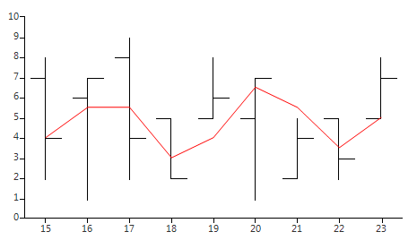
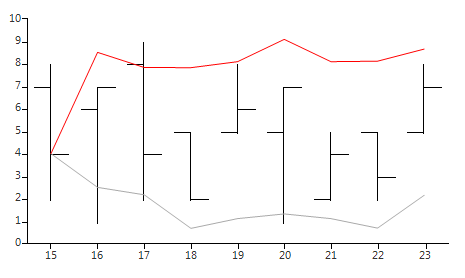

# Indicators

RadChartView offers more than 20 of the most frequently used technical indicators out of the box. The indicators compilation contains representatives of the moving average, momentum, volatility, and band categories. In their essence, indicators are line series that calculate each of their values using predefined interpretations of the incoming data. The simplest example would be the Moving Average, aka. Simple Moving Average, indicator, which averages the data for a certain number of past days. Each indicator type introduces a specific set of properties that allows you to change the parameters of the built-in formula. This article demonstrates how to setup two of the most popular indicators - Moving Average (MA) and Bollinger Bands. 

Let's start with creating some meaningful data that will be used by both indicators 

#### Initial Setup

<snippet id='chartview-indicators-indicatorscommondata-cs'/>
<snippet id='chartview-indicators-indicatorscommondata-vb'/>

## Moving Average Indicator

Each value of MA is the average of past __n__ days, where __n__ is a parameter defined by the __Period__ property. 

#### Average Indicator

<snippet id='chartview-indicators-ma-cs'/>
<snippet id='chartview-indicators-ma-vb'/>

>caption Figure 1: Average Indicator

## Bollinger Bands Indicator

The indicator consists of two bands that aim to provide a relative definition of high and low. The indicator uses a simple __Moving Average__ as a starting point and forms its two bands using the following formulas:

* __Upper band__: N-period MA + (N-period standard deviation * K)

* __Lower band__: N-period MA – (N-period standard deviation * K)

* __N__ is defined by the Period property. A typical value for N is 20.

* __K__ is defined by the StandardDeviations property. A typical value for K is 2. 

#### Bollinger Indicator

<snippet id='chartview-indicators-bands-cs'/>
<snippet id='chartview-indicators-bands-vb'/>

>caption Figure 2: Bollinger Indicator

# See Also

* [Series Types]()
* [Populating with Data]()
