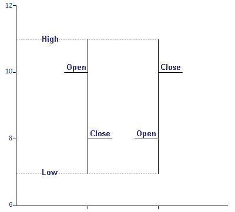
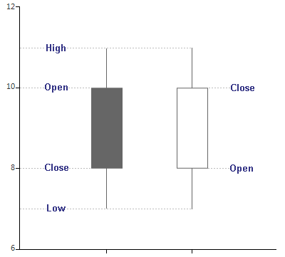
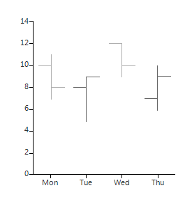
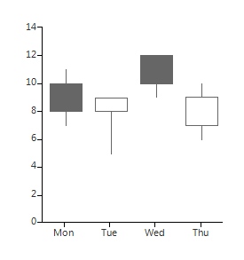

# Ohlc and Candlestick

__RadChartView__ introduces support for stock series – both __Ohlc (Open-High-Low-Close)__ and __Candlestick__. These series operate with special data points which hold information about each the following parameters: *open, high, low, close*. As members of the __Categorical__ series, stock series plot their data upon a categorical (or __DateTimeCategorical__) axis.

__Ohlc__ and __Candlestick__ series are indeed two alternative ways to visualize the same data. Here is how to read the values of an __Ohlc__ and __Candlestick__ point:
 

|  __Ohlc__  |  __Candlestick__  |
| ------ | ------ |
|||

Here is how to setup Ohlc series: 

#### Initial Setup OhlcSeries

<snippet id='chartview-ohlc-and-candlestick-ohlc-cs'/>
<snippet id='chartview-ohlc-and-candlestick-ohlc-vb'/>

>caption Figure 1: Initial Setup OhlcSeries

Here is how to setup Candlestick series:

#### Initial Setup CandlestickSeries

<snippet id='chartview-ohlc-and-candlestick-candlestick-cs'/>
<snippet id='chartview-ohlc-and-candlestick-candlestick-vb'/>

>caption Figure 2: Initial Setup CandlestickSeries

# See Also

* [Series Types]()
* [Populating with Data]()
