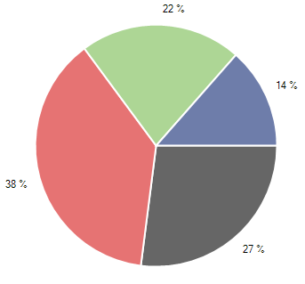
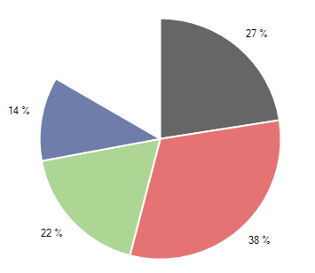
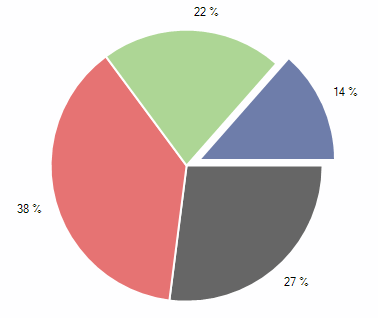

# Pie

Unlike all other series, __PieSeries__ do not require axes. They visualize each data point as a pie slices with arc size directly proportional to the magnitude of the raw data point’s value. It is important to note that the pie series are valid only in the context of Pie AreaType. Pie slices represent data in one dimension contrasting with the other series which represent data in two dimensions. Here is an example of how to create a pie chart with pie series populated with data:

#### Initial Setup

{{source=..\SamplesCS\ChartView\Series\PieSeriesForm.cs region=pie}} 
{{source=..\SamplesVB\ChartView\Series\PieSeriesForm.vb region=pie}} 

````C#
this.radChartView1.AreaType = ChartAreaType.Pie;
PieSeries series = new PieSeries();
series.DataPoints.Add(new PieDataPoint(50, "Germany"));
series.DataPoints.Add(new PieDataPoint(70, "United States"));
series.DataPoints.Add(new PieDataPoint(40, "France"));
series.DataPoints.Add(new PieDataPoint(25, "United Kingdom"));
series.ShowLabels = true;
this.radChartView1.Series.Add(series);

````
````VB.NET
Me.RadChartView1.AreaType = ChartAreaType.Pie
Dim series As New PieSeries()
series.DataPoints.Add(New PieDataPoint(50, "Germany"))
series.DataPoints.Add(New PieDataPoint(70, "United States"))
series.DataPoints.Add(New PieDataPoint(40, "France"))
series.DataPoints.Add(New PieDataPoint(25, "United Kingdom"))
series.ShowLabels = True
Me.RadChartView1.Series.Add(series)

````

{{endregion}} 

>caption Figure 1: Initial Setup


__PieSeries__ can be customized using the following properties:        

* __Range:__ The property consists of two parameters StartAngle and SweepAngle. StartAngle sets the angle in degrees from which the drawing of the pie segments will begin. Note that pie slices are always rendered in clockwise direction. SweepAngle determines if the chart will appear as a full circle or a partial circle.The snippet below illustrates PieSeries how to set the Range property: 

{{source=..\SamplesCS\ChartView\Series\PieSeriesForm.cs region=angleRange}} 
{{source=..\SamplesVB\ChartView\Series\PieSeriesForm.vb region=angleRange}} 

````C#
AngleRange range = new AngleRange(270, 300);
series.Range = range;

````
````VB.NET
Dim range As New AngleRange(270, 300)
series.Range = range

````

{{endregion}}

>caption Figure 2: Angle Range


* __ShowLabels:__ The property determines whether the labels above each point will be visible.

* __LabelMode__: Gets or sets the label mode of the __PieSeries__. The user can choose one of the following options: 
    - *Horizontal* - Each label is renderred horizontally. Its position from the center of its corresponding pie segment is determined by X property.
    - *Radial* - Each label is renderred radial to its corresponding Pie segment. Its position from the center of the chart is determined by X property.

* __RadiusFactor:__ The property can increase and decrease the diameter of the series. Setting the __RadiusFactor__ to *0.9* will decrease the radius of the series by *10 percent*. Similarly, the value *1.1* will increase it. Leaving the property with value *1* will make the donut fill the available space.            

Additionally, PieSeries allows offsetting a pie segment from the rest of the slices. This is achieved through the __OffsetFromCenter__ property of the individual PieDataPoint. The following snippet demonstrates how to shift the first pie piece: 

#### Offset Segment

{{source=..\SamplesCS\ChartView\Series\PieSeriesForm.cs region=offset}} 
{{source=..\SamplesVB\ChartView\Series\PieSeriesForm.vb region=offset}} 

````C#
PieDataPoint point = series.DataPoints[3] as PieDataPoint;
if (point != null)
{
    point.OffsetFromCenter = 0.1;
}

````
````VB.NET
Dim point As PieDataPoint = TryCast(series.DataPoints(3), PieDataPoint)
If point IsNot Nothing Then
    point.OffsetFromCenter = 0.1
End If

````

{{endregion}} 

>caption Figure 3: Offset Segment


# See Also

* [Series Types]()
* [Populating with Data]()
