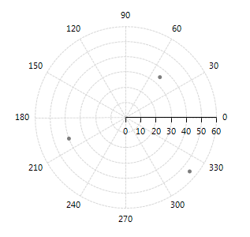
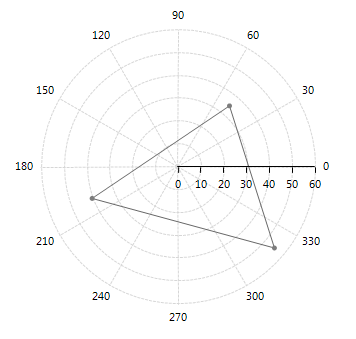
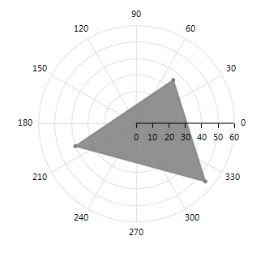

# Polar

__Polar series__ consists of a group of classes that plot data in radial plot area in polar coordinates. Valid only in the context of Polar AreaType, __Polar series__ have three implementations – __PolarLineSeries__, __PolarAreaSeries__ and __PolarPointSeries__. When working in unbound mode, the polar series are filled with PolarDataPoint objects which define __Angle__ and __Value__ properties which unambiguously determine a point's location in the polar coordinate system defined by the polar and numeric radial axes. Below is an example of RadPolarChart with different Polar series: 

#### Initial Setup

<snippet id='chartview-polar-polarpointseries-cs'/>
<snippet id='chartview-polar-polarpointseries-vb'/>

>caption Figure 1: Initial Setup

#### PolarLineSeries

<snippet id='chartview-polar-polarlineseries-cs'/>
<snippet id='chartview-polar-polarlineseries-vb'/>

>caption Figure 2: PolarLineSeries
 
 
#### PolarAreaSeries

<snippet id='chartview-polar-polarareaseries-cs'/>
<snippet id='chartview-polar-polarareaseries-vb'/>

>caption Figure 3: PolarAreaSeries

Here are some of the important properties all __PolarSeries__ share:

* __AngleMember:__ The property indicates the name of the property in the datasource that holds data about the angular coordinate.

* __ValueMember:__ The property determines the name of the property in the datasource that contains information about radial coordinate (the radius).

* __PointSize:__ The property determines the size of the drawn points in all three polar series.

* __BorderWidth:__  The property indicates the width of the lines in PolarLineSeries and PolarAreaSeries.

# See Also

* [Series Types]()
* [Populating with Data]()
