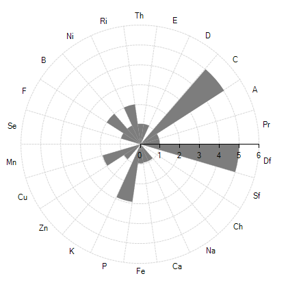
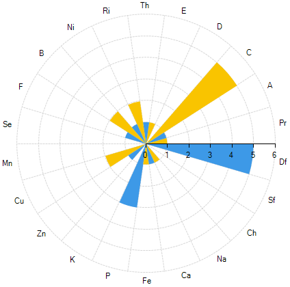

# Radar Column

Radar Column series visualize data in radial columns starting from one center point. The circle is divided into equal portions depending on the number of columns and each column group occupies one portion. The following article will introduce you to creating Radar Column series.


>caption Figure: 1 RadarColumn series. 




The following example shows how you can add RadarColumnSeries to RadChartView:

{{source=..\SamplesCS\ChartView\Series\RadarSeriesForm.cs region=radarColumnSeries}} 
{{source=..\SamplesVB\ChartView\Series\RadarSeriesForm.vb region=radarColumnSeries}}
````C#
List<string> categories = new List<string> {
            "Df", "Pr", "A", "C", "D", "E",
            "Th", "Ri", "Ni", "B", "F",
            "Se", "Mn", "Cu", "Zn", "K", "P",
            "Fe", "Ca", "Na", "Ch", "Sf" };
List<int> values = new List<int>() {
            5, 1, 1, 5, 0, 1,
            1, 2, 1, 2, 1, 0,
            0, 2, 1, 0, 3, 1,
            1, 1, 0, 0, };
RadarColumnSeries series = new RadarColumnSeries();
for (int i = 0; i < categories.Count; i++)
{
    series.DataPoints.Add(new CategoricalDataPoint(values[i], categories[i]));
}
radChartView1.AreaType = ChartAreaType.Polar;
radChartView1.Series.Add(series);

````
````VB.NET
Dim categories As New List(Of String) From {"Df", "Pr", "A", "C", "D", "E", "Th", "Ri", "Ni", "B", "F", "Se", "Mn", "Cu", "Zn", "K", "P", "Fe", "Ca", "Na", "Ch", "Sf"}
Dim values As New List(Of Integer)() From {5, 1, 1, 5, 0, 1, 1, 2, 1, 2, 1, 0, 0, 2, 1, 0, 3, 1, 1, 1, 0, 0}
Dim series As New RadarColumnSeries()
For i As Integer = 0 To categories.Count - 1
    series.DataPoints.Add(New CategoricalDataPoint(values(i), categories(i)))
Next i
RadChartView1.AreaType = ChartAreaType.Polar
RadChartView1.Series.Add(series)

```` 


{{endregion}} 


The following example shows how you can change the BackColor of particular pieces:

{{source=..\SamplesCS\ChartView\Series\RadarSeriesForm.cs region=SetColors}} 
{{source=..\SamplesVB\ChartView\Series\RadarSeriesForm.vb region=SetColors}}
````C#
for (int i = 0; i < series.Children.Count; i++)
{
    if (i % 2 == 0)
    {
        series.Children[i].BackColor = Color.FromArgb(61, 153, 231);
    }
    else
    {
        series.Children[i].BackColor = Color.FromArgb(249, 196, 0);
    }
}

````
````VB.NET
For i As Integer = 0 To series.Children.Count - 1
    If i Mod 2 = 0 Then
        series.Children(i).BackColor = Color.FromArgb(61, 153, 231)
    Else
        series.Children(i).BackColor = Color.FromArgb(249, 196, 0)
    End If
Next i

```` 


{{endregion}} 

Figure 2 shows the the result from the above code. 

>caption Figure: 2 RadarColumn series. 

 
