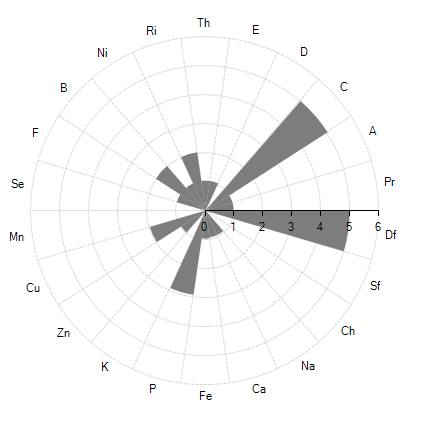
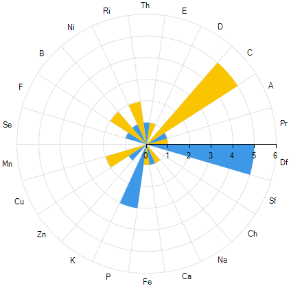

# Radar Column

Radar Column series visualize data in radial columns starting from one center point. The circle is divided into equal portions depending on the number of columns and each column group occupies one portion. The following article will introduce you to creating Radar Column series.

>caption Figure: 1 RadarColumn series. 

The following example shows how you can add RadarColumnSeries to RadChartView:

<snippet id='chartview-radar-column-radarcolumnseries-cs'/>
<snippet id='chartview-radar-column-radarcolumnseries-vb'/>

The following example shows how you can change the BackColor of particular pieces:

<snippet id='chartview-radar-column-setcolors-cs'/>
<snippet id='chartview-radar-column-setcolors-vb'/>

Figure 2 shows the the result from the above code. 

>caption Figure: 2 RadarColumn series. 

 
