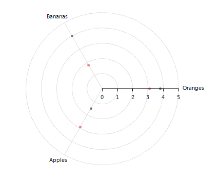
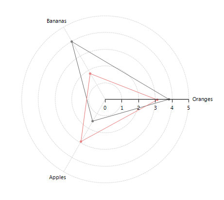
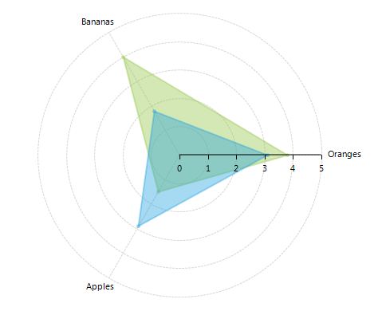
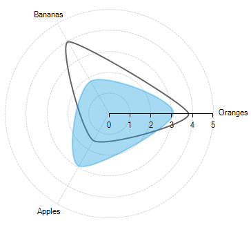

# Radar

The radar chart is a two-dimensional chart of three or more quantitative variables represented on axes starting from the same point. As a derivative of PolarSeries, __RadarSeries__ are valid only the context of Polar AreaType. RadChartView supports the following RadarSeries implementations out of the box: __RadarPointSeries__, __RadarLineSeries__ and __RadarAreaSeries__. Below are three snippets that illustrate how to set up each of these series: 

#### Initial Setup RadarPointSeries

{{source=..\SamplesCS\ChartView\Series\RadarSeriesForm.cs region=radarPointSeries}} 
{{source=..\SamplesVB\ChartView\Series\RadarSeriesForm.vb region=radarPointSeries}} 

````C#
this.radChartView1.AreaType = ChartAreaType.Polar;
RadarPointSeries radarPointSeries = new RadarPointSeries();
radarPointSeries.DataPoints.Add(new CategoricalDataPoint(3.8d, "Oranges"));
radarPointSeries.DataPoints.Add(new CategoricalDataPoint(4d, "Bananas"));
radarPointSeries.DataPoints.Add(new CategoricalDataPoint(1.5d, "Apples"));
this.radChartView1.Series.Add(radarPointSeries);
RadarPointSeries radarPointSeries2 = new RadarPointSeries();
radarPointSeries2.DataPoints.Add(new CategoricalDataPoint(3.1d, "Oranges"));
radarPointSeries2.DataPoints.Add(new CategoricalDataPoint(1.8d, "Bananas"));
radarPointSeries2.DataPoints.Add(new CategoricalDataPoint(2.9d, "Apples"));
this.radChartView1.Series.Add(radarPointSeries2);

````
````VB.NET
Me.RadChartView1.AreaType = ChartAreaType.Polar
Dim radarPointSeries As New RadarPointSeries()
radarPointSeries.DataPoints.Add(New CategoricalDataPoint(3.8D, "Oranges"))
radarPointSeries.DataPoints.Add(New CategoricalDataPoint(4D, "Bananas"))
radarPointSeries.DataPoints.Add(New CategoricalDataPoint(1.5D, "Apples"))
Me.RadChartView1.Series.Add(radarPointSeries)
Dim radarPointSeries2 As New RadarPointSeries()
radarPointSeries2.DataPoints.Add(New CategoricalDataPoint(3.1D, "Oranges"))
radarPointSeries2.DataPoints.Add(New CategoricalDataPoint(1.8D, "Bananas"))
radarPointSeries2.DataPoints.Add(New CategoricalDataPoint(2.9D, "Apples"))
Me.RadChartView1.Series.Add(radarPointSeries2)

````

{{endregion}} 

>caption Figure 1: Initial Setup RadarPointSeries
  

#### Initial Setup RadarLineSeries

{{source=..\SamplesCS\ChartView\Series\RadarSeriesForm.cs region=radarLineSeries}} 
{{source=..\SamplesVB\ChartView\Series\RadarSeriesForm.vb region=radarLineSeries}} 

````C#
this.radChartView1.AreaType = ChartAreaType.Polar;
RadarLineSeries radarLineSeries = new RadarLineSeries();
radarLineSeries.DataPoints.Add(new CategoricalDataPoint(3.8d, "Oranges"));
radarLineSeries.DataPoints.Add(new CategoricalDataPoint(4d, "Bananas"));
radarLineSeries.DataPoints.Add(new CategoricalDataPoint(1.5d, "Apples"));
this.radChartView1.Series.Add(radarLineSeries);
RadarLineSeries radarLineSeries2 = new RadarLineSeries();
radarLineSeries2.DataPoints.Add(new CategoricalDataPoint(3.1d, "Oranges"));
radarLineSeries2.DataPoints.Add(new CategoricalDataPoint(1.8d, "Bananas"));
radarLineSeries2.DataPoints.Add(new CategoricalDataPoint(2.9d, "Apples"));
this.radChartView1.Series.Add(radarLineSeries2);

````
````VB.NET
Me.RadChartView1.AreaType = ChartAreaType.Polar
Dim radarLineSeries As New RadarLineSeries()
radarLineSeries.DataPoints.Add(New CategoricalDataPoint(3.8D, "Oranges"))
radarLineSeries.DataPoints.Add(New CategoricalDataPoint(4D, "Bananas"))
radarLineSeries.DataPoints.Add(New CategoricalDataPoint(1.5D, "Apples"))
Me.RadChartView1.Series.Add(radarLineSeries)
Dim radarLineSeries2 As New RadarLineSeries()
radarLineSeries2.DataPoints.Add(New CategoricalDataPoint(3.1D, "Oranges"))
radarLineSeries2.DataPoints.Add(New CategoricalDataPoint(1.8D, "Bananas"))
radarLineSeries2.DataPoints.Add(New CategoricalDataPoint(2.9D, "Apples"))
Me.RadChartView1.Series.Add(radarLineSeries2)

````

{{endregion}} 

>caption Figure 2: Initial Setup RadarLineSeries
 

#### Initial Setup RadarAreaSeries

{{source=..\SamplesCS\ChartView\Series\RadarSeriesForm.cs region=radarAreaSeries}} 
{{source=..\SamplesVB\ChartView\Series\RadarSeriesForm.vb region=radarAreaSeries}} 

````C#
this.radChartView1.AreaType = ChartAreaType.Polar;
RadarAreaSeries radarAreaSeries = new RadarAreaSeries();
radarAreaSeries.BackColor = Color.FromArgb(100, 142, 196, 65);
radarAreaSeries.BorderColor = Color.FromArgb(100, 142, 196, 65);
radarAreaSeries.DataPoints.Add(new CategoricalDataPoint(3.8d, "Oranges"));
radarAreaSeries.DataPoints.Add(new CategoricalDataPoint(4d, "Bananas"));
radarAreaSeries.DataPoints.Add(new CategoricalDataPoint(1.5d, "Apples"));
this.radChartView1.Series.Add(radarAreaSeries);
RadarAreaSeries radarAreaSeries2 = new RadarAreaSeries();
radarAreaSeries2.BackColor = Color.FromArgb(100, 27, 157, 222);
radarAreaSeries2.BorderColor = Color.FromArgb(100, 27, 157, 222);
radarAreaSeries2.DataPoints.Add(new CategoricalDataPoint(3.1d, "Oranges"));
radarAreaSeries2.DataPoints.Add(new CategoricalDataPoint(1.8d, "Bananas"));
radarAreaSeries2.DataPoints.Add(new CategoricalDataPoint(2.9d, "Apples"));
this.radChartView1.Series.Add(radarAreaSeries2);

````
````VB.NET
Me.RadChartView1.AreaType = ChartAreaType.Polar
Dim radarAreaSeries As New RadarAreaSeries()
radarAreaSeries.BackColor = Color.FromArgb(100, 142, 196, 65)
radarAreaSeries.BorderColor = Color.FromArgb(100, 142, 196, 65)
radarAreaSeries.DataPoints.Add(New CategoricalDataPoint(3.8D, "Oranges"))
radarAreaSeries.DataPoints.Add(New CategoricalDataPoint(4D, "Bananas"))
radarAreaSeries.DataPoints.Add(New CategoricalDataPoint(1.5D, "Apples"))
Me.RadChartView1.Series.Add(radarAreaSeries)
Dim radarAreaSeries2 As New RadarAreaSeries()
radarAreaSeries2.BackColor = Color.FromArgb(100, 27, 157, 222)
radarAreaSeries2.BorderColor = Color.FromArgb(100, 27, 157, 222)
radarAreaSeries2.DataPoints.Add(New CategoricalDataPoint(3.1D, "Oranges"))
radarAreaSeries2.DataPoints.Add(New CategoricalDataPoint(1.8D, "Bananas"))
radarAreaSeries2.DataPoints.Add(New CategoricalDataPoint(2.9D, "Apples"))
Me.RadChartView1.Series.Add(radarAreaSeries2)

````

{{endregion}} 

>caption Figure 3: Initial Setup RadarAreaSeries


Here are some of the important properties all __PolarSeries__ share:

* __CategoryMember:__ The property indicates the name of the property in the datasource that holds data about the category.

* __ValueMember:__ The property determines the name of the property in the datasource that contains information about radial coordinate (the radius).

* __PointSize:__ The property determines the size of the drawn points in all three polar series.

* __BorderWidth:__  The property indicates the width of the lines in RadarLineSeries and RadarAreaSeries.

## RadarSplineSeries

When you have __RadarLineSeries__ or __RadarAreaSeries__ you can set the Spline property and smoth the values transition (the SplineTension property): 

#### Spline Settings

{{source=..\SamplesCS\ChartView\Series\RadarSeriesForm.cs region=spline}} 
{{source=..\SamplesVB\ChartView\Series\RadarSeriesForm.vb region=spline}} 

````C#
this.radChartView1.AreaType = ChartAreaType.Polar;
RadarLineSeries radarLineSeries = new RadarLineSeries();
radarLineSeries.DataPoints.Add(new CategoricalDataPoint(3.8d, "Oranges"));
radarLineSeries.DataPoints.Add(new CategoricalDataPoint(4d, "Bananas"));
radarLineSeries.DataPoints.Add(new CategoricalDataPoint(1.5d, "Apples"));
radarLineSeries.Spline = true;
radarLineSeries.SplineTension = 0.3f;
this.radChartView1.Series.Add(radarLineSeries);
RadarAreaSeries radarAreaSeries2 = new RadarAreaSeries();
radarAreaSeries2.BackColor = Color.FromArgb(100, 27, 157, 222);
radarAreaSeries2.BorderColor = Color.FromArgb(100, 27, 157, 222);
radarAreaSeries2.DataPoints.Add(new CategoricalDataPoint(3.1d, "Oranges"));
radarAreaSeries2.DataPoints.Add(new CategoricalDataPoint(1.8d, "Bananas"));
radarAreaSeries2.DataPoints.Add(new CategoricalDataPoint(2.9d, "Apples"));
radarAreaSeries2.Spline = true;
radarAreaSeries2.SplineTension = 0.5f;
this.radChartView1.Series.Add(radarAreaSeries2);

````
````VB.NET
Me.RadChartView1.AreaType = ChartAreaType.Polar
Dim radarLineSeries As New RadarLineSeries()
radarLineSeries.DataPoints.Add(New CategoricalDataPoint(3.8, "Oranges"))
radarLineSeries.DataPoints.Add(New CategoricalDataPoint(4.0, "Bananas"))
radarLineSeries.DataPoints.Add(New CategoricalDataPoint(1.5, "Apples"))
radarLineSeries.Spline = True
radarLineSeries.SplineTension = 0.3F
Me.RadChartView1.Series.Add(radarLineSeries)
Dim radarAreaSeries2 As New RadarAreaSeries()
radarAreaSeries2.BackColor = Color.FromArgb(100, 27, 157, 222)
radarAreaSeries2.BorderColor = Color.FromArgb(100, 27, 157, 222)
radarAreaSeries2.DataPoints.Add(New CategoricalDataPoint(3.1, "Oranges"))
radarAreaSeries2.DataPoints.Add(New CategoricalDataPoint(1.8, "Bananas"))
radarAreaSeries2.DataPoints.Add(New CategoricalDataPoint(2.9, "Apples"))
radarAreaSeries2.Spline = True
radarAreaSeries2.SplineTension = 0.5F
Me.RadChartView1.Series.Add(radarAreaSeries2)

````

{{endregion}}

>caption Figure 4: Spline Settings


# See Also

* [Series Types]()
* [Populating with Data]()
