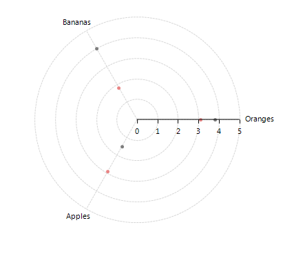
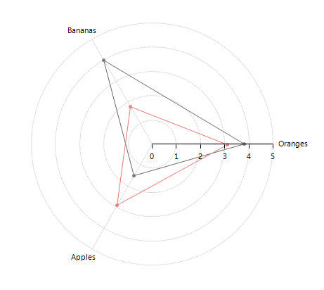
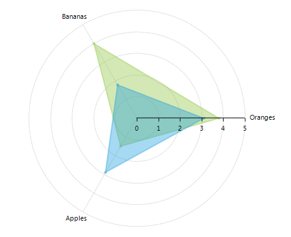
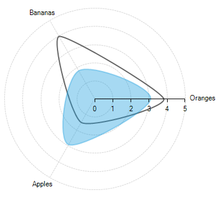

# Radar

The radar chart is a two-dimensional chart of three or more quantitative variables represented on axes starting from the same point. As a derivative of PolarSeries, __RadarSeries__ are valid only the context of Polar AreaType. RadChartView supports the following RadarSeries implementations out of the box: __RadarPointSeries__, __RadarLineSeries__ and __RadarAreaSeries__. Below are three snippets that illustrate how to set up each of these series: 

#### Initial Setup RadarPointSeries

<snippet id='chartview-radar-radarpointseries-cs'/>
<snippet id='chartview-radar-radarpointseries-vb'/>

>caption Figure 1: Initial Setup RadarPointSeries
  

#### Initial Setup RadarLineSeries

<snippet id='chartview-radar-radarlineseries-cs'/>
<snippet id='chartview-radar-radarlineseries-vb'/>

>caption Figure 2: Initial Setup RadarLineSeries
 

#### Initial Setup RadarAreaSeries

<snippet id='chartview-radar-radarareaseries-cs'/>
<snippet id='chartview-radar-radarareaseries-vb'/>

>caption Figure 3: Initial Setup RadarAreaSeries

Here are some of the important properties all __PolarSeries__ share:

* __CategoryMember:__ The property indicates the name of the property in the datasource that holds data about the category.

* __ValueMember:__ The property determines the name of the property in the datasource that contains information about radial coordinate (the radius).

* __PointSize:__ The property determines the size of the drawn points in all three polar series.

* __BorderWidth:__  The property indicates the width of the lines in RadarLineSeries and RadarAreaSeries.

## RadarSplineSeries

When you have __RadarLineSeries__ or __RadarAreaSeries__ you can set the Spline property and smoth the values transition (the SplineTension property): 

#### Spline Settings

<snippet id='chartview-radar-spline-cs'/>
<snippet id='chartview-radar-spline-vb'/>

>caption Figure 4: Spline Settings

# See Also

* [Series Types]()
* [Populating with Data]()
