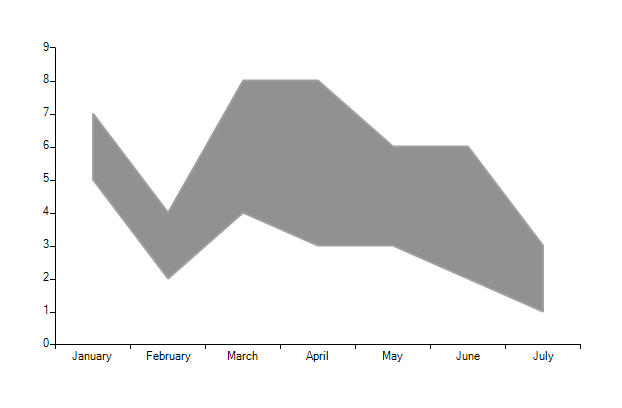
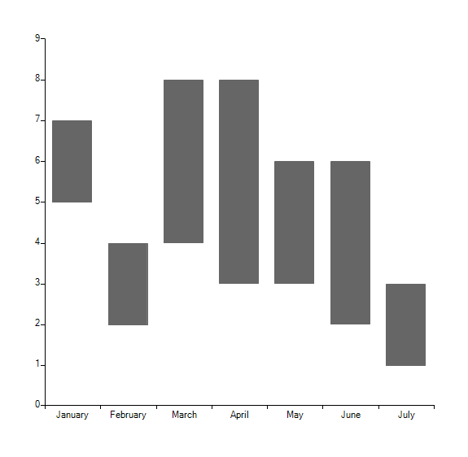

# Range and RangeBar

## RangeSeries

The __Range__ series allows you to define range with each data point. 

You can use the following code to display a simple __RangeSeries__

#### Initial Setup RangeSeries

<snippet id='chartview-range-and-rangebar-range-cs'/>
<snippet id='chartview-range-and-rangebar-range-vb'/>

>caption Figure 1: Initial Setup RangeSeries

## RangeBarSeries

This series is visualized on the screen as separate rectangles representing each of the DataPoints.

You can use the following code to display a simple RangeBarSeries 

#### Initial Setup RangeBarSeries
 
<snippet id='chartview-range-and-rangebar-bar-cs'/>
<snippet id='chartview-range-and-rangebar-bar-vb'/>

>caption Figure 2: Initial Setup RangeBarSeries

# See Also

* [Series Types]()
* [Populating with Data]()
