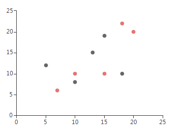
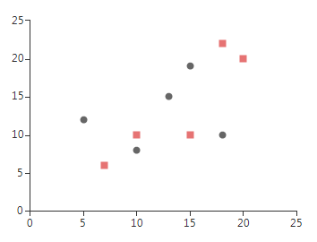

# Scatter

Unlike Categorical series, __ScatterSeries__ plots its data upon two numerical axes. Scatter series identify the position of each __ScatterDataPoint__ using two numerical values - *XValue* and *YValue* for the horizontal and vertical axes respectively, just like in the typical Cartesian coordinate system. Here is how to create two ScatterSeries and populate them manually:

#### Initial Setup

{{source=..\SamplesCS\ChartView\Series\ScatterSeriesForm.cs region=scatter}} 
{{source=..\SamplesVB\ChartView\Series\ScatterSeriesForm.vb region=scatter}} 

````C#
            
ScatterSeries scatterSeries = new ScatterSeries();
scatterSeries.Name = "";
scatterSeries.DataPoints.Add(new ScatterDataPoint(15, 19));
scatterSeries.DataPoints.Add(new ScatterDataPoint(18, 10));
scatterSeries.DataPoints.Add(new ScatterDataPoint(13, 15));
scatterSeries.DataPoints.Add(new ScatterDataPoint(10, 8));
scatterSeries.DataPoints.Add(new ScatterDataPoint(5, 12));
scatterSeries.PointSize = new SizeF(8, 8);
this.radChartView1.Series.Add(scatterSeries);
            
ScatterSeries scatterSeries2 = new ScatterSeries();
scatterSeries2.Name = "";
scatterSeries2.DataPoints.Add(new ScatterDataPoint(20, 20));
scatterSeries2.DataPoints.Add(new ScatterDataPoint(15, 10));
scatterSeries2.DataPoints.Add(new ScatterDataPoint(7, 6));
scatterSeries2.DataPoints.Add(new ScatterDataPoint(18, 22));
scatterSeries2.DataPoints.Add(new ScatterDataPoint(10, 10));
scatterSeries2.PointSize = new SizeF(8, 8);
scatterSeries.Shape = new RoundRectShape(0);
this.radChartView1.Series.Add(scatterSeries2);

````
````VB.NET
Dim scatterSeries As New ScatterSeries()
scatterSeries.Name = ""
scatterSeries.DataPoints.Add(New ScatterDataPoint(15, 19))
scatterSeries.DataPoints.Add(New ScatterDataPoint(18, 10))
scatterSeries.DataPoints.Add(New ScatterDataPoint(13, 15))
scatterSeries.DataPoints.Add(New ScatterDataPoint(10, 8))
scatterSeries.DataPoints.Add(New ScatterDataPoint(5, 12))
scatterSeries.PointSize = New SizeF(8, 8)
Me.RadChartView1.Series.Add(scatterSeries)
Dim scatterSeries2 As New ScatterSeries()
scatterSeries2.Name = ""
scatterSeries2.DataPoints.Add(New ScatterDataPoint(20, 20))
scatterSeries2.DataPoints.Add(New ScatterDataPoint(15, 10))
scatterSeries2.DataPoints.Add(New ScatterDataPoint(7, 6))
scatterSeries2.DataPoints.Add(New ScatterDataPoint(18, 22))
scatterSeries2.DataPoints.Add(New ScatterDataPoint(10, 10))
scatterSeries2.PointSize = New SizeF(8, 8)
Me.RadChartView1.Series.Add(scatterSeries2)

````

{{endregion}} 


>caption Figure 1: Initial Setup


__ScatterSeries__ have few important properties:

* __PointSize:__ The property defines the size of the ScatterSeries points.

* __XValueMember:__ If a DataSource is set, the property determines the name of the field that holds the XValue.

* __YValueMember:__ If a DataSource is set, the property determines the name of the field that holds the YValue.

* __Shape:__ To change the shape of a series points use the Shape property of the series 

#### Custom Shape

{{source=..\SamplesCS\ChartView\Series\ScatterSeriesForm.cs region=shape}} 
{{source=..\SamplesVB\ChartView\Series\ScatterSeriesForm.vb region=shape}} 

````C#
            
RoundRectShape shape = new RoundRectShape(0);
scatterSeries2.Shape = shape;

````
````VB.NET
Dim shape As New RoundRectShape(0)
scatterSeries2.Shape = shape

````

{{endregion}} 

>caption Figure 2: Custom Shape


# See Also

* [Series Types]()
* [Populating with Data]()
* [How to Plot Error Bars (x-y) on a Scatter Plot]()
