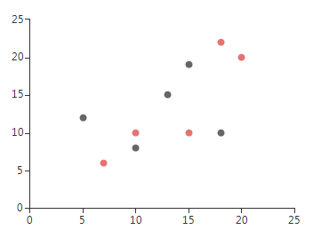
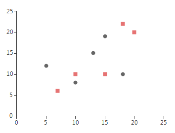

# Scatter

Unlike Categorical series, __ScatterSeries__ plots its data upon two numerical axes. Scatter series identify the position of each __ScatterDataPoint__ using two numerical values - *XValue* and *YValue* for the horizontal and vertical axes respectively, just like in the typical Cartesian coordinate system. Here is how to create two ScatterSeries and populate them manually:

#### Initial Setup

<snippet id='chartview-scatter-scatter-cs'/>
<snippet id='chartview-scatter-scatter-vb'/>

>caption Figure 1: Initial Setup

__ScatterSeries__ have few important properties:

* __PointSize:__ The property defines the size of the ScatterSeries points.

* __XValueMember:__ If a DataSource is set, the property determines the name of the field that holds the XValue.

* __YValueMember:__ If a DataSource is set, the property determines the name of the field that holds the YValue.

* __Shape:__ To change the shape of a series points use the Shape property of the series 

#### Custom Shape

<snippet id='chartview-scatter-shape-cs'/>
<snippet id='chartview-scatter-shape-vb'/>

>caption Figure 2: Custom Shape

# See Also

* [Series Types]()
* [Populating with Data]()
* [How to Plot Error Bars (x-y) on a Scatter Plot]()
* [How to Detect if Mouse Click Location Belongs to ScatterLineSeries]()
