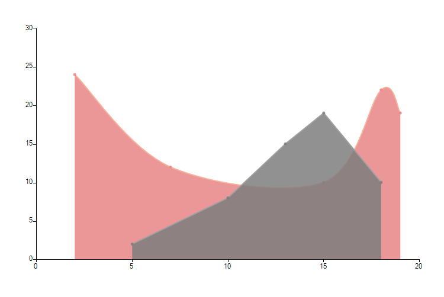
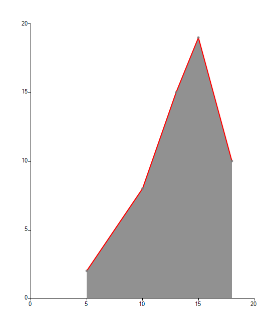

# ScatterArea

__ScatterAreaSeries__ plot their data using two numerical values. Once positioned on a plane the points are connected to form a line. Further, the area enclosed by this line and the categorical axis is filled. Below is a sample snippet that demonstrates how to set up two ScaterArea series: 

#### Initial Setup

<snippet id='chartview-scatterarea-area-cs'/>
<snippet id='chartview-scatterarea-area-vb'/>

>caption Figure 1: Initial Setup

## Properties

The following list shows the most important properties of the __ScaterAreaSeries__.

* __XValueMember:__ If a DataSource is set, the property determines the name of the field that holds the XValue.

* __YValueMember:__ If a DataSource is set, the property determines the name of the field that holds the YValue.

* __Spline:__ Boolean property, which indicates whether the series will draw straight lines of smooth curves.

* __SplineTension:__ The property sets the tension of the spline. The property will have effect only if the Spline property is set to true.

* __StrokeMode:__ This property controls what part of the area border should be marked with line.

#### Set StrokeMode

<snippet id='chartview-scatterarea-stroke-cs'/>
<snippet id='chartview-scatterarea-stroke-vb'/>

>caption Figure 2: Stroke Mode
 

# See Also

* [Series Types]()
* [Populating with Data]()

