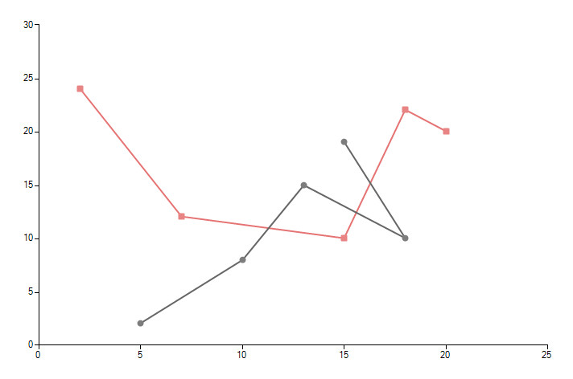
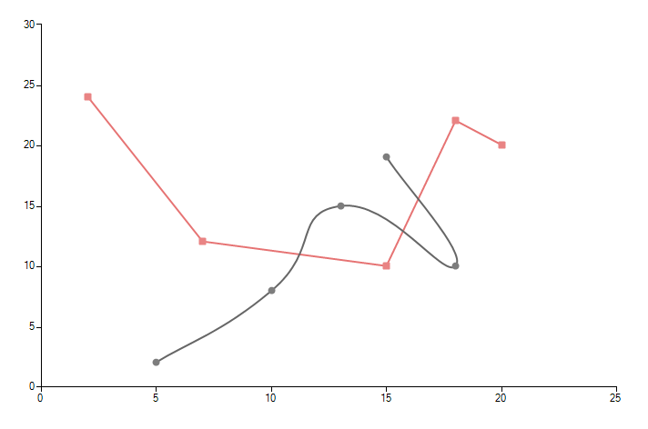

# ScatterLine

__ScatterLineSeries__ allow data represented as a line to be plotted against two linear axes. Each point from the line in the chart is defined by two numeric values – __XValue__ and __YValue__ for the horizontal and for the vertical axis respectively. This chart type is the closest resemblance of the mathematical Cartesian coordinate system. Next we create a simple chart with two lines: 

#### Initial Setup

{{source=..\SamplesCS\ChartView\Series\ScatterLineSeriesForm.cs region=scatterLineSetup}} 
{{source=..\SamplesVB\ChartView\Series\ScatterLineSeriesForm.vb region=scatterLineSetup}} 

````C#
ScatterLineSeries scatterSeries = new ScatterLineSeries();
scatterSeries.DataPoints.Add(new ScatterDataPoint(15, 19));
scatterSeries.DataPoints.Add(new ScatterDataPoint(18, 10));
scatterSeries.DataPoints.Add(new ScatterDataPoint(13, 15));
scatterSeries.DataPoints.Add(new ScatterDataPoint(10, 8));
scatterSeries.DataPoints.Add(new ScatterDataPoint(5, 2));
scatterSeries.PointSize = new SizeF(8, 8);
this.radChartView1.Series.Add(scatterSeries);
ScatterLineSeries scatterSeries2 = new ScatterLineSeries();
scatterSeries2.DataPoints.Add(new ScatterDataPoint(2, 24));
scatterSeries2.DataPoints.Add(new ScatterDataPoint(7, 12));
scatterSeries2.DataPoints.Add(new ScatterDataPoint(15, 10));
scatterSeries2.DataPoints.Add(new ScatterDataPoint(18, 22));
scatterSeries2.DataPoints.Add(new ScatterDataPoint(20, 20));
scatterSeries2.Shape = new RoundRectShape(1);
scatterSeries2.PointSize = new SizeF(8, 8);
this.radChartView1.Series.Add(scatterSeries2);

````
````VB.NET
Dim scatterSeries As New ScatterLineSeries()
scatterSeries.DataPoints.Add(New ScatterDataPoint(15, 19))
scatterSeries.DataPoints.Add(New ScatterDataPoint(18, 10))
scatterSeries.DataPoints.Add(New ScatterDataPoint(13, 15))
scatterSeries.DataPoints.Add(New ScatterDataPoint(10, 8))
scatterSeries.DataPoints.Add(New ScatterDataPoint(5, 2))
scatterSeries.PointSize = New SizeF(8, 8)
Me.radChartView1.Series.Add(scatterSeries)
Dim scatterSeries2 As New ScatterLineSeries()
scatterSeries2.DataPoints.Add(New ScatterDataPoint(2, 24))
scatterSeries2.DataPoints.Add(New ScatterDataPoint(7, 12))
scatterSeries2.DataPoints.Add(New ScatterDataPoint(15, 10))
scatterSeries2.DataPoints.Add(New ScatterDataPoint(18, 22))
scatterSeries2.DataPoints.Add(New ScatterDataPoint(20, 20))
scatterSeries2.Shape = New RoundRectShape(1)
scatterSeries2.PointSize = New SizeF(8, 8)
Me.radChartView1.Series.Add(scatterSeries2)

````

{{endregion}} 

>caption Figure 1: Initial Setup


__ScatterLineSeries__ inherit from __ScatterSeries__ thus all important properties are inherited as well. Two important properties are added for the scatter line:

* __Spline:__ Boolean property, which indicates whether the series will draw straight lines of smooth curves.            

* __SplineTension:__ The property sets the tension of the spline. The property will have effect only if the __Spline__ property is set to __true__.

#### Spline Settings
 
{{source=..\SamplesCS\ChartView\Series\ScatterLineSeriesForm.cs region=scatterLineSpline}} 
{{source=..\SamplesVB\ChartView\Series\ScatterLineSeriesForm.vb region=scatterLineSpline}} 

````C#
scatterSeries.Spline = true;
scatterSeries.SplineTension = 0.8f;

````
````VB.NET
scatterLine.Spline = True
scatterLine.SplineTension = 0.8F

````

{{endregion}} 

>caption Figire 2: Spline Settings


# See Also

* [Series Types]()
* [Populating with Data]()
* [How to Detect if Mouse Click Location Belongs to ScatterLineSeries]()
