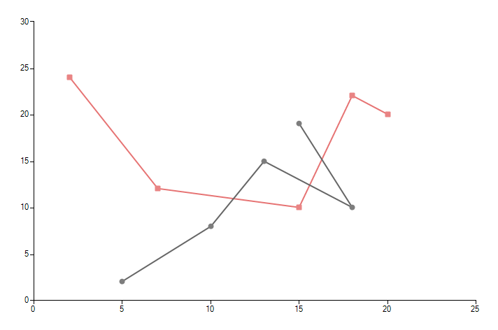
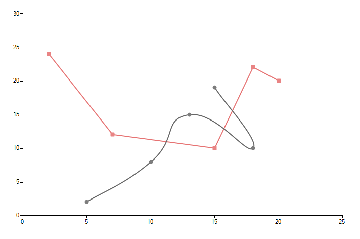

# ScatterLine

__ScatterLineSeries__ allow data represented as a line to be plotted against two linear axes. Each point from the line in the chart is defined by two numeric values – __XValue__ and __YValue__ for the horizontal and for the vertical axis respectively. This chart type is the closest resemblance of the mathematical Cartesian coordinate system. Next we create a simple chart with two lines: 

#### Initial Setup

<snippet id='chartview-scatterline-scatterlinesetup-cs'/>
<snippet id='chartview-scatterline-scatterlinesetup-vb'/>

>caption Figure 1: Initial Setup

__ScatterLineSeries__ inherit from __ScatterSeries__ thus all important properties are inherited as well. Two important properties are added for the scatter line:

* __Spline:__ Boolean property, which indicates whether the series will draw straight lines of smooth curves.            

* __SplineTension:__ The property sets the tension of the spline. The property will have effect only if the __Spline__ property is set to __true__.

#### Spline Settings
 
<snippet id='chartview-scatterline-scatterlinespline-cs'/>
<snippet id='chartview-scatterline-scatterlinespline-vb'/>

>caption Figire 2: Spline Settings

# See Also

* [Series Types]()
* [Populating with Data]()
* [How to Detect if Mouse Click Location Belongs to ScatterLineSeries]()
