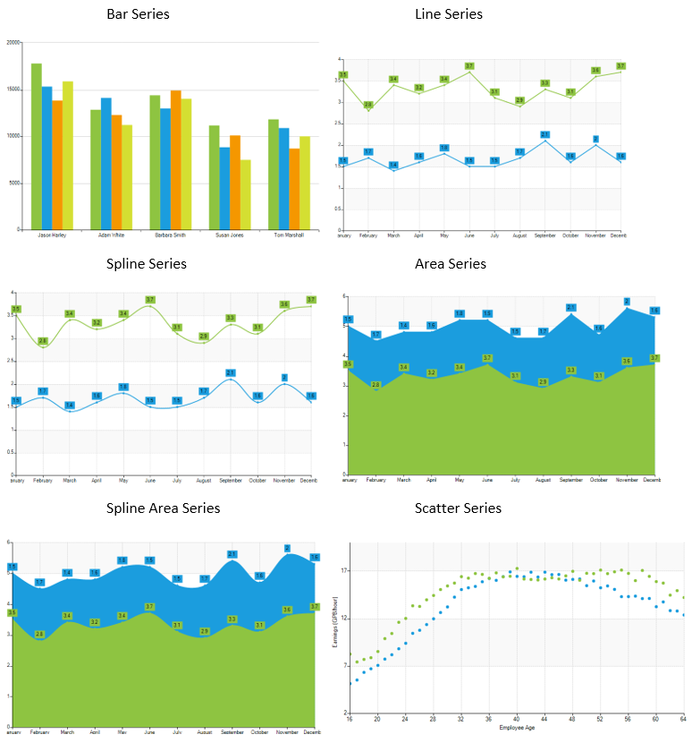
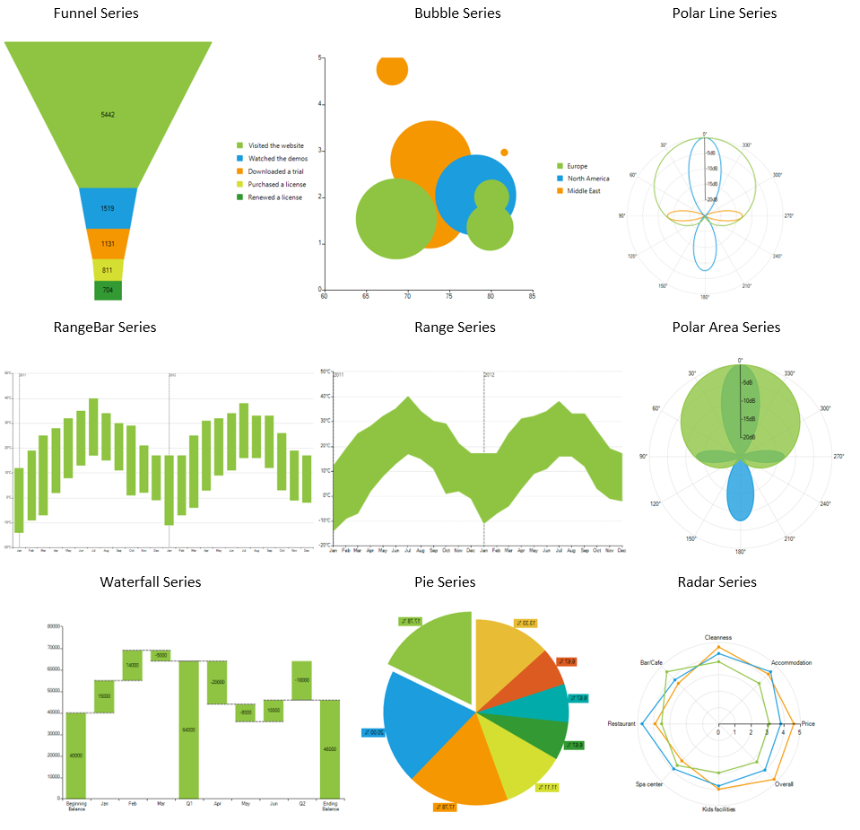

# Series Types

Chart series have two primary functions: (1) they contain a collection of specific data points representing the actual data, and (2) they visualize the data using an internal predefined model determined by the series type. __RadChartView__ supports a number of series types – __Bar__, __Line__ (__Spline__), __Area__ (__Spline Area__), __Scatter__, __Stock__, __Pie__, __Donut__, __Polar__, __Radar__ – and each of them can be used only with a certain area type - __Categorical__, __Pie__ or __Polar__. The following schema shows the set of series supported by each area type:

* __Cartesian Area__: Supports __Bar__, __Line__, __Area__, __Ohlc__, __Candlestick__ and __Scatter__ series. This area sets a standard Cartesian coordinate system where the position of each point on the plane is identified through a pair of values. Series supported in RadChartView’s Cartesian area can be classified in two groups – scatter and categorical. While the former positions its point using two numerical values and, therefore, requires two numerical axes, the latter uses one numerical and one categorical value to plot its data points. The Categorical series you will be able to use with __RadChartView__ are __Bar__, __Line__ (__Spline__), __Area__ (__Spline Area__), Ohlc, Candlestick. Currently the control supports only Scatter point series.

>note The **CartesianSeries** also defines the **ClipLabels** property which is by default set to *false*. This property determines whether the series labels will be clipped according to the viewport`s width and height.

* __Pie Area__: Supports __Pie__, __Donut__ series. Unlike all other areas, __Pie__ area does not use axes. It displays each data point as slices with arc size directly proportional to the magnitude of the raw data point’s value. The supported series types are __Pie__ and __Donut__.

* __Polar Area__: Supports __Polar__ (__Point__, __Line__, __Area__) and __Radar__ (__Point__, __Line__, __Area__) series. This area setups a polar coordinate system, where each value is positioned using a value-angle couple. Additionally, the __Polar__ area renders __Radar__ series, which splits the polar area into equal-size category sectors.

* **Funnel Area**: Supports **FunnelSeries**. **Funnel** area doesn't use an axis as well. It displays a single series of data in progressively decreasing or increasing proportions, organized in segments, where each segment represents the value for the particular item from the series. The items' values can also influence the height and the shape of the corresponding segments.

Each series type contains a __DataPoints__ collection that contains specific data points. For example, __Bar__, __Line__ and __Area__ series work with __CategoricalDataPoints__. __Scatter__ and __Pie__ series, however, operate only with __ScatterDataPoints__ and __PieDataPoints__ respectively. Each series type visualizes the data in the best way to present the information stored in its data points. The screenshots below illustrate how each series type is rendered: 

>caption Figure 1: Series Types

Chart series support both bound and unbound mode. All series contain the following two binding properties - __DataSource__ and __ValueMember__. Once a __DataSource__ is assigned, the __ValueMember__ property is used to resolve the property of the data records visualized by the data points. Different series types introduce additional data binding properties, related to the specific of the contained data. These are __CategoricalMember__, __AngleMember__, __XValueMember__, __YValueMember__. In unbound mode, categorical series can be populated with data manually using the __DataPoints__ collection.

A common scenario for __RadChartView__ is to contain several series instances, which could be of different types. For example, you can easily combine derivatives of __CategoricalSeries__ class.

The chart series also have a mechanism for combining data points that reside in different series but have the same category. This mechanism is controlled via the __CombineMode__ property. The combine mode can be *None*, *Cluster* and *Stack*.        

* __None:__ The series will be plotted independently of each other.

* __Cluster:__ The data points will be in the same category huddled close together.

* __Stack:__ Plots the points on top of each other.

* __Stack100:__ Presents the values of one series as a percentage of the other series.

# See Also

* [Getting Started]()
* [Populating with Data]()
