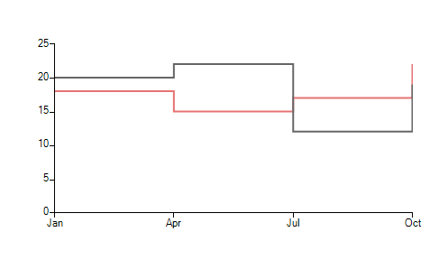
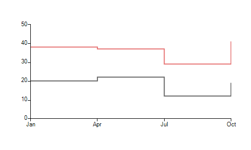
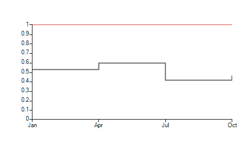

# Stepline

__SteplineSeries__ plot their Categorical data points on Cartesian Area using one categorical and one numerical axis. Points are connected with two straight lines one horizontal and one vertical with an 90° angle between them. Here is how to set up two stepline series:

#### Initial Setup

<snippet id='chartview-stepline-initialize-cs'/>
<snippet id='chartview-stepline-initialize-vb'/>

>caption Figure 1: Initial Setup

The essential properties of SteplineSeries are:

* __BorderWidth:__ Тhe property determines the thickness of the lines
            
* __PointSize:__ Тhe property denotes the size of the points
            
* __ShowLabels:__ Тhe property determines whether the labels above each point will be visible
            
* __CombineMode:__ А common property for all categorical series, which introduces a mechanism for combining data points that reside in different series but have the same category. The combine mode can be None, __Cluster__, __Stack__ and __Stack100__. In the case of stepline series, __None__ and __Cluster__ mean that the series will be plotted independently of each other, so that they are overlapping. __Stack__ plots the points on top of each other and __Stack100__ presents the values of one series as a percentage of the other series. The combine mode is best described by a picture:

>caption Figure 2: None/Cluster

>caption Figure 3: Stack

>caption Figure 4: Stack100

# See Also

* [Series Types]()
* [Populating with Data]()
