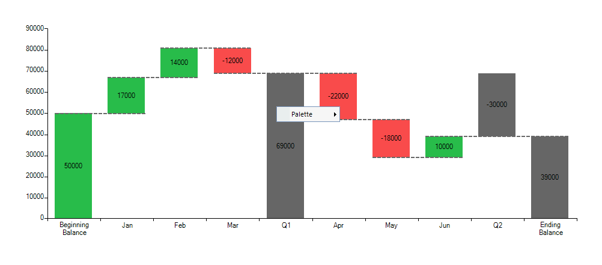

# Waterfall

A waterfall chart type (a.k.a. flying bricks, bridge, etc.) shows the cumulative effect of positive or negative values on the starting point. Its purpose is to provide a better understanding of how an initial amount is influenced by subsequently added positive or negative values. Generally, the first and last items of a waterfall series are denoted by whole columns while items in the middle are shown as floating columns. You can, however, control whether the last and middle items display the current value (e.g. a floating column set through the __Value__ property) or the sum of all previous values (e.g. a whole column using the __IsSummary__ and __IsTotal__ properties of the __WaterfallDataPoint__). 

A Waterfall chart is useful for different types of quantitative analysis related to inventory, cash flows, performance, etc. This chart type looks like a [range column chart]() where the low  or high value of a subsequent item is connected to the preceding one with a line. 

>caption Figure 1: WaterFallSeries

The example above can be achieved with the following code snippet:  

#### Initial Setup

<snippet id='chartview-watterfall-unboundmode-cs'/>
<snippet id='chartview-watterfall-unboundmode-vb'/>

To achieve the same chart in a data bound mode you will need appropriate data and once it is in place, you need to set the following properties:

* __SummaryMember:__ When the data contains summary data point the cart will display the balance up to that data point (like "Q1" in th example).

* __TotalMember:__ This is the final data point and it will display the average value.

You need to set the standard databinding properties as well ([Binding to BindingList]() ValueMember, CategoryMember and DataSource). Here is an example: 

#### Data Binding WaterFallSeries

<snippet id='chartview-watterfall-databinding-cs'/>
<snippet id='chartview-watterfall-databinding-vb'/>

# See Also

* [Series Types]()
* [Populating with Data]()

