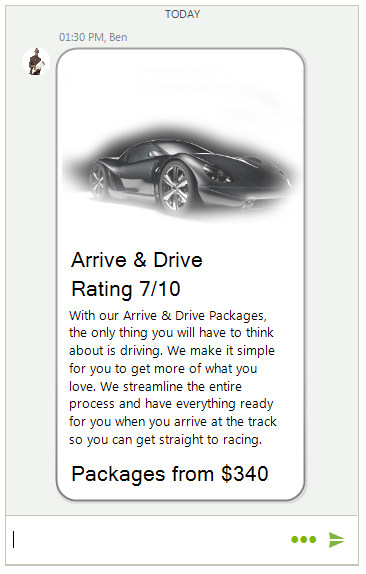
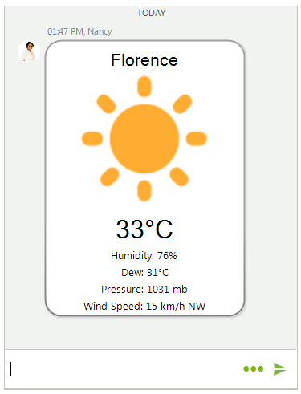
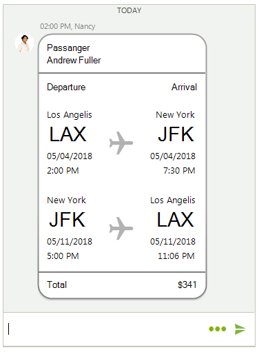
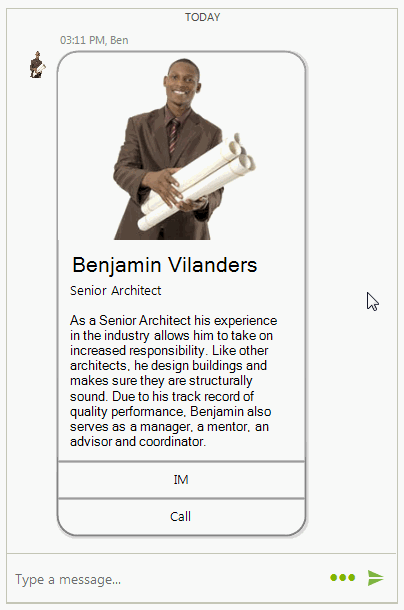

# Cards

**RadChat** offers different cards to display data in a structured layout. Thus, the visually ordered information is easier to digest for the user. In addition, it may respond to users' action.

 

Depending on the information that is presented, the cards can be one of the following types:

## ChatImageCardElement

**ChatImageCardElement** illustrates an image and several fields with additional information. It resembles a business card.

>caption Figure 1: ChatImageCardElement

 

#### Adding a ChatImageCardElement programmatically

{{source=..\SamplesCS\Chat\ChatCards.cs region=ImageCard}} 
{{source=..\SamplesVB\Chat\ChatCards.vb region=ImageCard}}

````C#
Telerik.WinControls.UI.ChatImageCardDataItem imageCard = new ChatImageCardDataItem(Properties.Resources.architect, "Benjamin Vilanders", "Senior Architect",
                                                                                                                                                            "As a Senior Architect his experience in the industry allows him to take on increased responsibility. Like other architects, he design buildings " +
                                                                                                                                                            "and makes sure they are structurally sound. Due to his track record of quality performance, Benjamin also serves as a manager, a mentor, an advisor and coordinator.",
    null, null);
Author author = new Author(Properties.Resources.architect, "Ben");
ChatCardMessage message = new ChatCardMessage(imageCard, author, DateTime.Now);
this.radChat1.AddMessage(message);

````
````VB.NET
Dim imageCard As Telerik.WinControls.UI.ChatImageCardDataItem = New ChatImageCardDataItem(My.Resources.architect, "Benjamin Vilanders", _
                                                                                          "Senior Architect", "As a Senior Architect his experience in the industry allows him to take on increased responsibility. Like other architects, he design buildings " & _
                                                                                          "and makes sure they are structurally sound. Due to his track record of quality performance, Benjamin also serves as a manager, a mentor, an advisor and coordinator.", Nothing, Nothing)
Dim author As Author = New Author(My.Resources.architect, "Ben")
Dim message As ChatCardMessage = New ChatCardMessage(imageCard, author, DateTime.Now)
Me.radChat1.AddMessage(message)

```` 


{{endregion}}

## ChatProductCardElement

**ChatProductCardElement** illustrates an image and several fields with additional information. It resembles a product brochure.

>caption Figure 2: ChatProductCardElement

 

#### Adding a ChatProductCardElement programmatically

{{source=..\SamplesCS\Chat\ChatCards.cs region=ProductCard}} 
{{source=..\SamplesVB\Chat\ChatCards.vb region=ProductCard}}

````C#
ChatProductCardDataItem productCard = new ChatProductCardDataItem(Properties.Resources.TV_car1, "Arrive & Drive", "Rating 7/10",
                                                                                                                              "With our Arrive & Drive Packages, the only thing you will have to think about is driving. We make it simple for you to get more of what you love. We streamline the " +
                                                                                                                              "entire process and have everything ready for you when you arrive at the track so you can get straight to racing.", "Packages from $340", null, null);
Author author = new Author(Properties.Resources.architect, "Ben");
ChatCardMessage message = new ChatCardMessage(productCard, author, DateTime.Now);
this.radChat1.AddMessage(message);

````
````VB.NET
Dim productCard As ChatProductCardDataItem = New ChatProductCardDataItem(My.Resources.TV_car1, "Arrive & Drive", "Rating 7/10", _
                                                                         "With our Arrive & Drive Packages, the only thing you will have to think about is driving. We make it simple for you to get more of what you love. We streamline the " & _
                                                                         "entire process and have everything ready for you when you arrive at the track so you can get straight to racing.", "Packages from $340", Nothing, Nothing)
Dim author As Author = New Author(My.Resources.architect, "Ben")
Dim message As ChatCardMessage = New ChatCardMessage(productCard, author, DateTime.Now)
Me.radChat1.AddMessage(message)

```` 


{{endregion}}

## ChatWeatherCardElement

**ChatWeatherCardElement** illustrates a simple weather forecast.

>caption Figure 3: ChatWeatherCardElement

 

#### Adding a ChatWeatherCardElement programmatically

{{source=..\SamplesCS\Chat\ChatCards.cs region=WeatherCard}} 
{{source=..\SamplesVB\Chat\ChatCards.vb region=WeatherCard}}

````C#
ChatWeatherCardDataItem weatherCard = new ChatWeatherCardDataItem("Florence", Properties.Resources.sunny, "33°C", "Humidity: 76%", "Dew: 31°C",
    "Pressure: 1031 mb", "Wind Speed: 15 km/h NW");
Author author = new Author(Properties.Resources.nancy1, "Nancy");
ChatCardMessage message = new ChatCardMessage(weatherCard, author, DateTime.Now);
this.radChat1.AddMessage(message);

````
````VB.NET
Dim weatherCard As ChatWeatherCardDataItem = New ChatWeatherCardDataItem("Florence", My.Resources.sunny, "33°C", "Humidity: 76%", "Dew: 31°C", "Pressure: 1031 mb", "Wind Speed: 15 km/h NW")
Dim author As Author = New Author(My.Resources.nancy1, "Nancy")
Dim message As ChatCardMessage = New ChatCardMessage(weatherCard, author, DateTime.Now)
Me.radChat1.AddMessage(message)

```` 


{{endregion}}

## ChatFlightCardElement

**ChatFlightCardElement** illustrates flights' information in a structured and user-friendly layout. 

>caption Figure 4: ChatFlightCardElement

 

#### Adding a ChatFlightCardElement programmatically

{{source=..\SamplesCS\Chat\ChatCards.cs region=FlightCard}} 
{{source=..\SamplesVB\Chat\ChatCards.vb region=FlightCard}}

````C#
List<FlightInfo> flights = new List<FlightInfo>();
flights.Add(new FlightInfo("Los Angelis", "LAX", DateTime.Now.AddDays(7), "New York", "JFK", DateTime.Now.AddDays(7).AddHours(5.5)));
flights.Add(new FlightInfo("New York", "JFK", DateTime.Now.AddDays(14).AddHours(3), "Los Angelis", "LAX", DateTime.Now.AddDays(14).AddHours(9.1)));
ChatFlightCardDataItem flightCard = new ChatFlightCardDataItem("Andrew Fuller", flights, Properties.Resources.CardPlane, "$341", null);
Author author = new Author(Properties.Resources.nancy1, "Nancy");
ChatCardMessage message = new ChatCardMessage(flightCard, author, DateTime.Now);
this.radChat1.AddMessage(message);

````
````VB.NET
Dim flights As List(Of FlightInfo) = New List(Of FlightInfo)()
flights.Add(New FlightInfo("Los Angelis", "LAX", DateTime.Now.AddDays(7), "New York", "JFK", DateTime.Now.AddDays(7).AddHours(5.5)))
flights.Add(New FlightInfo("New York", "JFK", DateTime.Now.AddDays(14).AddHours(3), "Los Angelis", "LAX", DateTime.Now.AddDays(14).AddHours(9.1)))
Dim flightCard As ChatFlightCardDataItem = New ChatFlightCardDataItem("Andrew Fuller", flights, My.Resources.CardPlane, "$341", Nothing)
Dim author As Author = New Author(My.Resources.nancy1, "Nancy")
Dim message As ChatCardMessage = New ChatCardMessage(flightCard, author, DateTime.Now)
Me.radChat1.AddMessage(message)

```` 


{{endregion}}

The above examples demonstrates how to add the different card types in a simple **ChatCardMessage**. **RadChat** offers **ChatCarouselMessage** which allows adding and visualizing multiple card elements. Additional information is available in the [Messages]() help article.

>caption Figure 5: ChatCarouselMessage

 

## Card Actions

Each card allows you to add a certain action that can be handled:

#### Adding ChatCardActions

{{source=..\SamplesCS\Chat\ChatCards.cs region=CardActions}} 
{{source=..\SamplesVB\Chat\ChatCards.vb region=CardActions}}

````C#
List<ChatCardAction> actions = new List<ChatCardAction>();
actions.Add(new ChatCardAction("IM"));
actions.Add(new ChatCardAction("Call"));
Telerik.WinControls.UI.ChatImageCardDataItem imageCard = new ChatImageCardDataItem(Properties.Resources.architect, "Benjamin Vilanders", "Senior Architect",
                                                                                                                                                            "As a Senior Architect his experience in the industry allows him to take on increased responsibility. Like other architects, he design buildings " +
                                                                                                                                                            "and makes sure they are structurally sound. Due to his track record of quality performance, Benjamin also serves as a manager, a mentor, an advisor and coordinator.",
    actions, null);
Author author = new Author(Properties.Resources.architect, "Ben");
ChatCardMessage message = new ChatCardMessage(imageCard, author, DateTime.Now);
this.radChat1.AddMessage(message);

````
````VB.NET
Dim actions As List(Of ChatCardAction) = New List(Of ChatCardAction)()
actions.Add(New ChatCardAction("IM"))
actions.Add(New ChatCardAction("Call"))
Dim imageCard As Telerik.WinControls.UI.ChatImageCardDataItem = New ChatImageCardDataItem(My.Resources.architect, "Benjamin Vilanders", "Senior Architect", "As a Senior Architect his experience in the industry allows him to take on increased responsibility. Like other architects, he design buildings " & "and makes sure they are structurally sound. Due to his track record of quality performance, Benjamin also serves as a manager, a mentor, an advisor and coordinator.", actions, Nothing)
Dim author As Author = New Author(My.Resources.architect, "Ben")
Dim message As ChatCardMessage = New ChatCardMessage(imageCard, author, DateTime.Now)
Me.radChat1.AddMessage(message)

```` 


{{endregion}}

The RadChat.**CardActionClicked** event is fired once a user clicks on the action's text. The **CardActionEventArgs** gives you access to the **ChatCardAction** and user's data. 

#### Handling ChatCardActions

{{source=..\SamplesCS\Chat\ChatCards.cs region=HandleAction}} 
{{source=..\SamplesVB\Chat\ChatCards.vb region=HandleAction}}

````C#
private void radChat1_CardActionClicked(object sender, CardActionEventArgs e)
{
    if (e.Action.Text == "IM")
    {
        RadMessageBox.Show("IM is clicked.");
    }
    else if (e.Action.Text == "Call")
    {
        RadMessageBox.Show("Call is clicked");
    }
}

````
````VB.NET
Private Sub radChat1_CardActionClicked(ByVal sender As Object, ByVal e As CardActionEventArgs)
    If e.Action.Text = "IM" Then
        RadMessageBox.Show("IM is clicked.")
    ElseIf e.Action.Text = "Call" Then
        RadMessageBox.Show("Call is clicked")
    End If
End Sub

```` 


{{endregion}}

>caption Figure 6: Handling ChatCardActions

 

 
# See Also

* [Structure]()
* [Getting Started]()
 
        
