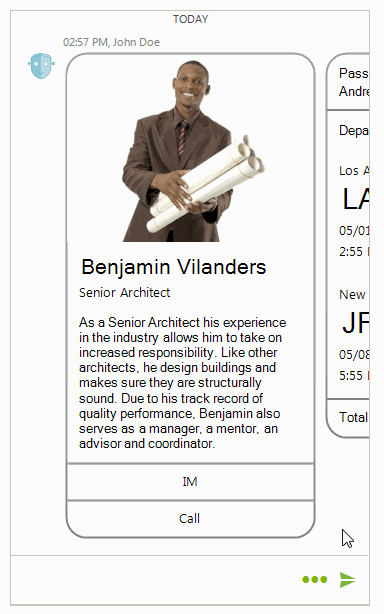
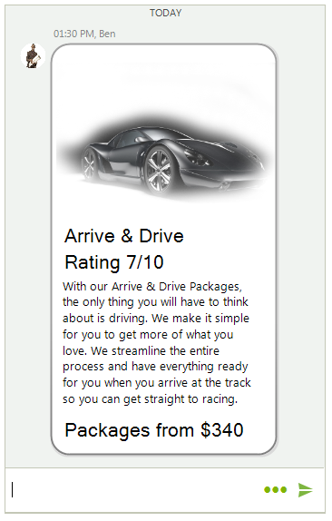
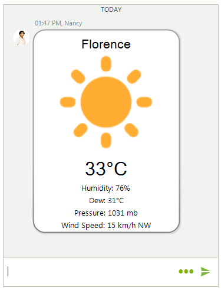
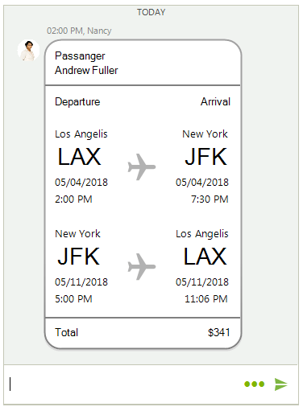
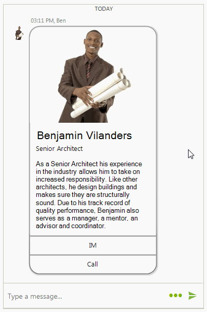

# Cards

**RadChat** offers different cards to display data in a structured layout. Thus, the visually ordered information is easier to digest for the user. In addition, it may respond to users' action.

 

Depending on the information that is presented, the cards can be one of the following types:

## ChatImageCardElement

**ChatImageCardElement** illustrates an image and several fields with additional information. It resembles a business card.

>caption Figure 1: ChatImageCardElement

 

#### Adding a ChatImageCardElement programmatically

<snippet id='chat-cards-imagecard-cs'/>
<snippet id='chat-cards-imagecard-vb'/>

## Chat Product Card Element

**ChatProductCardElement** illustrates an image and several fields with additional information. It resembles a product brochure.

>caption Figure 2: ChatProductCardElement

 

#### Adding a ChatProductCardElement programmatically

<snippet id='chat-cards-productcard-cs'/>
<snippet id='chat-cards-productcard-vb'/>

## ChatWeatherCardElement

**ChatWeatherCardElement** illustrates a simple weather forecast.

>caption Figure 3: ChatWeatherCardElement

 

#### Adding a ChatWeatherCardElement programmatically

<snippet id='chat-cards-weathercard-cs'/>
<snippet id='chat-cards-weathercard-vb'/>

## ChatFlightCardElement

**ChatFlightCardElement** illustrates flights' information in a structured and user-friendly layout. 

>caption Figure 4: ChatFlightCardElement

 

#### Adding a ChatFlightCardElement programmatically

<snippet id='chat-cards-flightcard-cs'/>
<snippet id='chat-cards-flightcard-vb'/>

The above examples demonstrates how to add the different card types in a simple **ChatCardMessage**. **RadChat** offers **ChatCarouselMessage** which allows adding and visualizing multiple card elements. Additional information is available in the [Messages]() help article.

>caption Figure 5: ChatCarouselMessage

 

## Card Actions

Each card allows you to add a certain action that can be handled:

#### Adding ChatCardActions

<snippet id='chat-cards-cardactions-cs'/>
<snippet id='chat-cards-cardactions-vb'/>

The RadChat.**CardActionClicked** event is fired once a user clicks on the action's text. The **CardActionEventArgs** gives you access to the **ChatCardAction** and user's data. 

#### Handling ChatCardActions

<snippet id='chat-cards-handleaction-cs'/>
<snippet id='chat-cards-handleaction-vb'/>

>caption Figure 6: Handling ChatCardActions

 

 
# See Also

* [Structure]()
* [Getting Started]()
 
        
