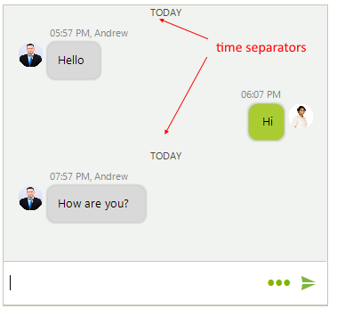
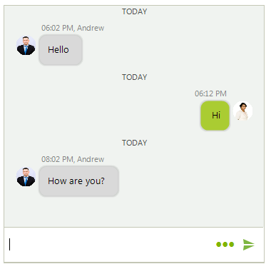
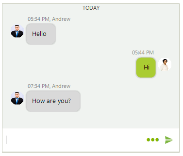
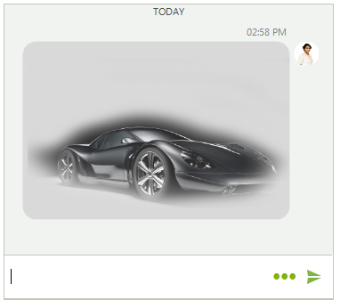
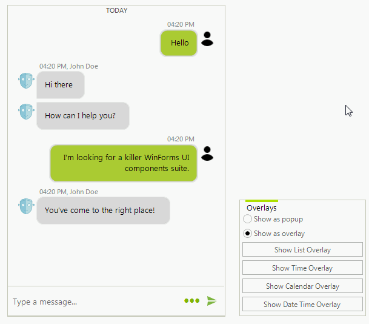
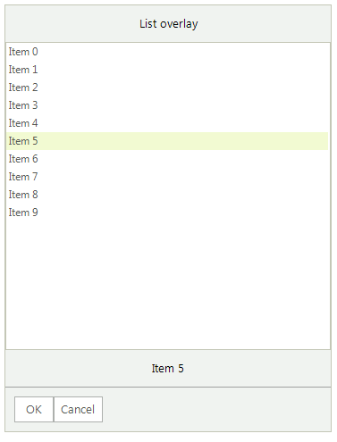
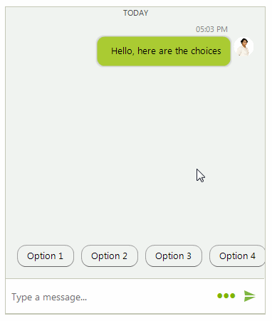

# Messages

**ChatMessage** is the basic message unit in **RadChat**. It contains information about the author and time of message. Depending on the specific information that a message stores, the available message types are listed below. 

By default, when you type in the text box and confirm the message, it is automatically added to **RadChat**. This behavior can be controlled by the **AutoAddUserMessages** property. In addition, the **SendMessage** is fired each time a new message is about to be added to the chat UI. It is allowed to modify the message itself. 

>note Since **R3 2018** it is exposed a **UserData** property in all message types. Thus, along with all other parameters when adding a message, you can pass some useful data that can store any information.

## ChatTimeSeparatorMessage

A **ChatTimeSeparatorMessage** visually separates the messages according to a certain period of time. The **TimeSeparatorInterval** property specifies this interval. **RadChat** will automatically add the time separators when the interval between the messages exceeds the specified **TimeSeparatorInterval**.

>caption Figure 1: ChatTimeSeparatorMessage

 

#### Setting TimeSeparatorInterval

<snippet id='chat-messages-timeseparatorinterval-cs'/>
<snippet id='chat-messages-timeseparatorinterval-vb'/>

When a new message is added, the **TimeSeparatorAdding** event is fired. It gives you the opportunity to control whether to add a time separator or not no matter the already specified **TimeSeparatorInterval**. The following example adds a time separator if the interval between messages is more than 20 seconds:

#### Handling TimeSeparatorAdding

<snippet id='chat-messages-timeseparatoradding-cs'/>
<snippet id='chat-messages-timeseparatoradding-vb'/>

>caption Figure 2: ChatTimeSeparatorMessage

 

## ChatTextMessage

A **ChatTextMessage** represents a single text message by a certain author and sent at certain time.

>caption Figure 3: ChatTextMessages

 

#### Adding Text Messages

<snippet id='chat-messages-addtextmessage-cs'/>
<snippet id='chat-messages-addtextmessage-vb'/>

## ChatMediaMessage

A **ChatMediaMessage** represents an image message by a certain author and sent at certain time.

>caption Figure 4: ChatMediaMessage

 

#### Adding Media Message

<snippet id='chat-messages-addmediamessage-cs'/>
<snippet id='chat-messages-addmediamessage-vb'/>

## ChatCardMessage

A **ChatCardMessage** stores a message that visualizes a card element, a descendant of **BaseChatCardElement**. In the [Cards]() help article you can find additional information about the different card types and how to add card messages. 

## ChatCarouselMessage

A **ChatCarouselMessage** allows adding and visualizing multiple [card elements](). You can also add different actions to the cards. Since R3 2019 you can use the __ShowScrollBar__ property in order to show the horizontal scrollbar.

>caption Figure 5: ChatCarouselMessage

 

#### Adding Carousel Message with Cards

<snippet id='chat-messages-addcarouselmessage-cs'/>
<snippet id='chat-messages-addcarouselmessage-vb'/>

## ChatOverlayMessage

A **ChatOverlayMessage** represents a **ChatMessage** that displays an [overlay element]() either as a popup, or over the messages container. It requires some action by the user, e.g. pick a date or select an item. Once the action is performed, a message is inserted in the chat view.

>caption Figure 6: ChatOverlayMessage

 

#### Adding a ChatListOverlay Message 

<snippet id='chat-messages-addoverlaymessage-cs'/>
<snippet id='chat-messages-addoverlaymessage-vb'/>

>caption Figure 7: ChatListOverlay

 

The **ChatOverlayMessage** can host any **BaseChatOverlay**: **ChatCalendarOverlay**, **ChatDateTimeOverlay**, **ChatListOverlay**, **ChatTimeOverlay**.

## ChatSuggestedActionsMessage

A **ChatSuggestedActionsMessage** represents a message offering a list of **SuggestedActionDataItem** to the user. Once an action is selected, the **SuggestedActionClicked** event is fired. Then, you can choose how to proceed further, e.g. adding a message with the user's choice. Since R3 2019 you can use the __ShowScrollBar__ property in order to show the horizontal scrollbar.

>caption Figure 8: ChatSuggestedActionsMessage

 

#### Adding a ChatSuggestedActionsMessage Message 

<snippet id='chat-messages-addsuggestedactionsmessage-cs'/>
<snippet id='chat-messages-addsuggestedactionsmessage-vb'/>

 
# See Also

* [Overlays]()
* [Cards]()
* [Getting Started]()
* [Reversed Order of Chat Messages]()
* [How to Format the Time Separator in RadChat]()
 
        
