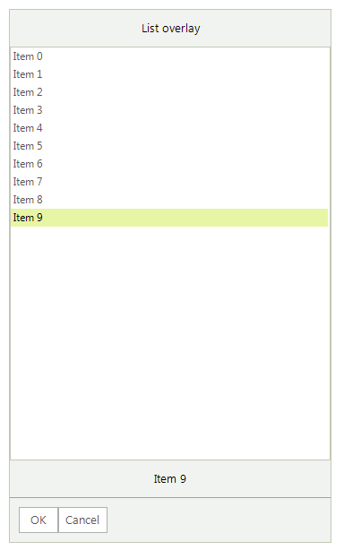
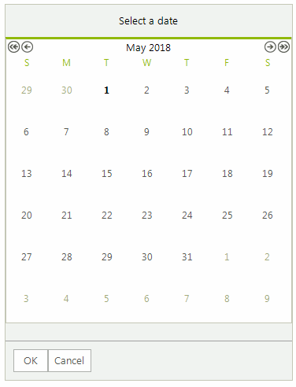
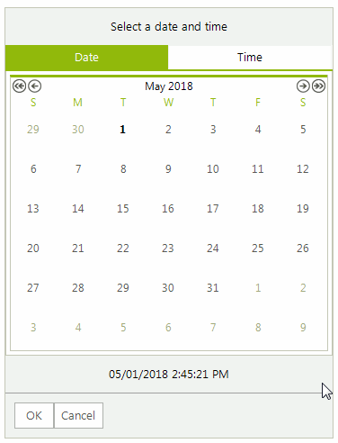
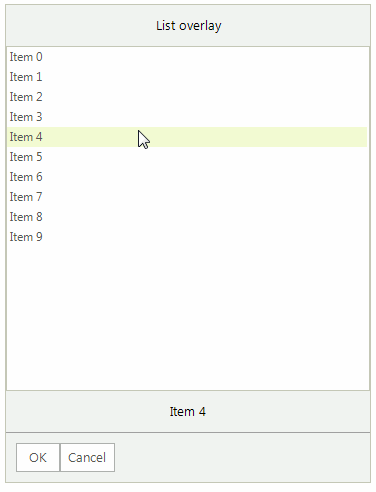
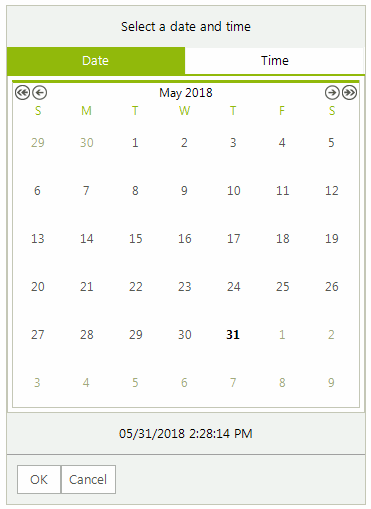

# Overlays

**RadChat** offers different overlays to present the user a selection of choices either as a pop up, or over the messages' view. The overlay is visible until the user selects a certain choice. 

Depending on the information that is presented and the choice that should be made, the overlays can be one of the types listed below. 

When you press the `OK` button, a new message will be automatically added with the selected option. The **SendMessage** event will be fired with the respective message as well. In the event handler you can change the message itself, e.g. modify its text.

## ChatCalendarOverlay

**ChatCalendarOverlay** offers to the user the ability to select a date from the calendar. 

>caption Figure 1: ChatCalendarOverlay

 

#### Adding a ChatCalendarOverlay

<snippet id='chat-overlays-addcalendaroverlay-cs'/>
<snippet id='chat-overlays-addcalendaroverlay-vb'/>

You have access to the calendar itself by the ChatCalendarOverlay.**Calendar** property. 

## ChatDateTimeOverlay

**ChatDateTimeOverlay** offers to the user the ability to select date and time from the picker. 

>caption Figure 2: ChatDateTimeOverlay

 

#### Adding a ChatDateTimeOverlay

<snippet id='chat-overlays-adddatetimeoverlay-cs'/>
<snippet id='chat-overlays-adddatetimeoverlay-vb'/>

## ChatListOverlay

**ChatListOverlay** offers to the user the ability to select an item from a predefined list of choices.

>caption Figure 3: ChatListOverlay

 

#### Adding a ChatListOverlay

<snippet id='chat-overlays-addlistoverlay-cs'/>
<snippet id='chat-overlays-addlistoverlay-vb'/>

You have access to the list view by the ChatListOverlay.**ListView** property. 

## ChatTimeOverlay

**ChatTimeOverlay** offers to the user the ability to select time from the picker. 

>caption Figure 4: ChatTimeOverlay

 

#### Adding a ChatTimeOverlay

<snippet id='chat-overlays-addtimeoverlay-cs'/>
<snippet id='chat-overlays-addtimeoverlay-vb'/>

 
# See Also

* [Messages]()
* [Cards]()
* [Getting Started]()
 
        
