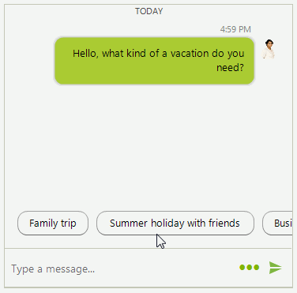

# Suggested Actions

**RadChat** offers different suggested actions to present the user a selection of action choices. Once an action is selected, the **SuggestedActionClicked** event is fired. Then, you can choose how to proceed further, e.g. adding a message with the user's choice. The **SuggestedActionEventArgs** gives you access to the **SuggestedActionDataItem**. 

>caption Figure 1: Suggested Actions

 

**SuggestedActionDataItem** is single action unit that can be added to a [ChatSuggestedActionsMessage](). Since R3 2019 you can use the __ShowScrollBar__ property in order to show the horizontal scrollbar. 

#### Adding a SuggestedActionDataItem

<snippet id='chat-suggested-actions-addsuggestedactions-cs'/>
<snippet id='chat-suggested-actions-addsuggestedactions-vb'/>

 
 
# See Also

* [Messages]()
* [Cards]()
* [Getting Started]()
 
        
