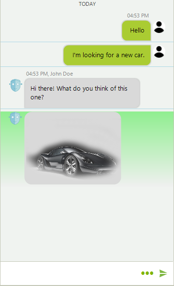
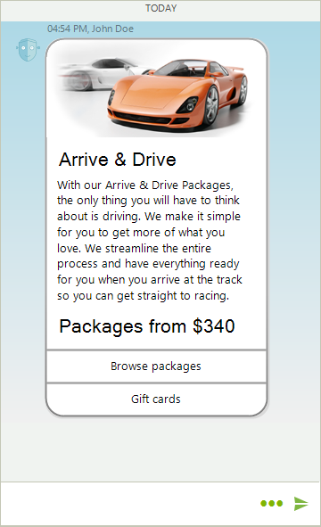
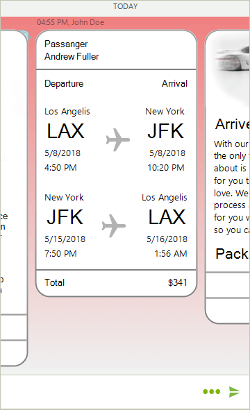
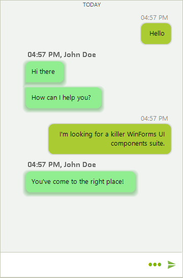

# Accessing and Customizing Elements

**RadChat** is virtualized and the displayed messages can be accessed in the RadChat.**ItemFormatting** event.    

>note The [structure]() articles provides detailed information about the element hierarchy building the visual tree of the control.

**RadChat** is working with the following elements visually representing a message:

* **TextMessageItemElement**: Represents a single message item consisting of text.

* **MediaMessageItemElement**: Represents a single message item consisting of an image.

* **CardMessageItemElement**: A single message item presented in a card. The card item can have:

  * **ChatImageCardElement**: A card element with an image.
  
  * **ChatFlightCardElement**: Predefined card element providing flight information.

  * **ChatProductCardElement**: Predefined card element providing product information.
  
  * **ChatWeatherCardElement**: Predefined card element providing weather information.
  
* **CarouselMessageItemElement**: Item element consisting of a horizontal stack which can be populated with *Image*, *Flight*, *Product*, and *Weather* cards.

* **AIChatMessageItemElement**: Represents an AI-generated message item that can display reply bubbles and streaming content.

The chat toolbar, input text box, prompt input element, and reply preview element are exposed as properties and they can be accessed through the **RadChatElement** object:

* RadChat.ChatElement.**InputTextBox** — the text entry element.
* RadChat.ChatElement.**ToolbarElement** — the toolbar element.
* RadChat.ChatElement.**PromptInputElement** — the prompt input element providing text entry, attached files, speech-to-text, and send capabilities.
* RadChat.ChatElement.**ReplyPreviewElement** — the reply preview element shown above the input area when replying to a message.

# ItemFormatting Event

The **ItemFormatting** event can be used to access and change the styling of the message item elements.

>note Due to the UI virtualization, the event needs to be handled with an *if-else* statement so that the applied settings are reset for elements which will not be customized. 
>

#### Customizing The Main Item Elements

<snippet id='chat-accessing-and-customizing-elements-radchatitemformatting-cs'/>
<snippet id='chat-accessing-and-customizing-elements-radchatitemformatting-vb'/>

>caption Figure 1: Text and Media Items 

>caption Figure 2: Card Items

>caption Figure 3: Carousel Item

#### Customizing the Child Items

<snippet id='chat-accessing-and-customizing-elements-itemformattingcildren-cs'/>
<snippet id='chat-accessing-and-customizing-elements-itemformattingcildren-vb'/>

>caption Figure 4: Customizing the Child Elements

# See Also

* [Structure]()
* [Getting Started]()
* [Toolbar]()
* [How to Format the Time Separator in RadChat]()
 
        
