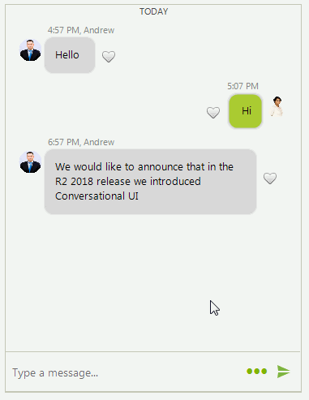

# Custom Items

By using the [ChatFactory](), it is possible to customize all visual elements and data items in the Chat UI. It is just necessary to create your own factory, override the relevant method where the element/item you want to replace is created and create your custom class. 

Each **BaseChatItemElement** can be customized according to any specific requirements. There are different methods which can be overridden according to inner element you want to modify:

* **CreateAvatarElement** - it creates the **ChatMessageAvatarElement**.
* **CreateNameLabel** - it creates the **ChatMessageNameElement**.
* **CreateStatusLabel** - it creates the **ChatMessageStatusElement**.
* **CreateMainMessageElement** - it creates the **ChatMessageBubbleElement**.
* **CreateChildElements** - it calls all of the above methods to create all internal elements of the message.

The following example demonstrates a sample code snippet how to add a button element next to the message indicating whether you like a certain message:

>caption Figure 1. Custom message

 

#### Creating a custom message

<snippet id='chat-custom-items-custommessage-cs'/>
<snippet id='chat-custom-items-custommessage-vb'/>

## See Also

* [How to Select and Copy Text in Chat Messages]()
* [How to Display Code Snippets in Chat Messages]()
* [Messages]()
* [Cards]()
* [Overlays]()
* [Suggested Actions]()
* [ChatElementFactory]()

 
        
