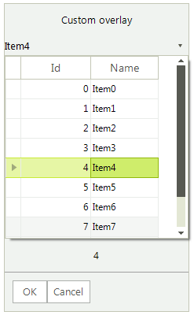

# Custom Overlays

**RadChat** presents a selection of choices to the user via overlays which are displayed until the user selects a certain choice. Depending on the information that is displayed (date, date and time, time, list options), different overlays can be used. It is possible to construct your own overlay hosting the control which is most appropriate for your custom scenario. 

This article demonstrates a sample approach how to host a [RadMultiColumnComboBox]() in a custom overlay item. 

>caption Figure 1: Custom overlay with a RadMultiColumnComboBox

 

To achieve this goal, you need to create a derivative of the **BaseChatItemOverlay** class:

#### Constructing a custom overlay with RadMultiColumnComboBox

<snippet id='chat-custom-overlays-customoverlay-cs'/>
<snippet id='chat-custom-overlays-customoverlay-vb'/>

Then, you just need to add your overlay to the **Chat UI** when it is necessary to present the user the options from which to choose:

#### Adding a custom overlay to the Chat UI

<snippet id='chat-custom-overlays-useoverlay-cs'/>
<snippet id='chat-custom-overlays-useoverlay-vb'/>

# See Also

* [Overview]()
* [Overlays]()
* [ChatElementFactory]()

 
        
