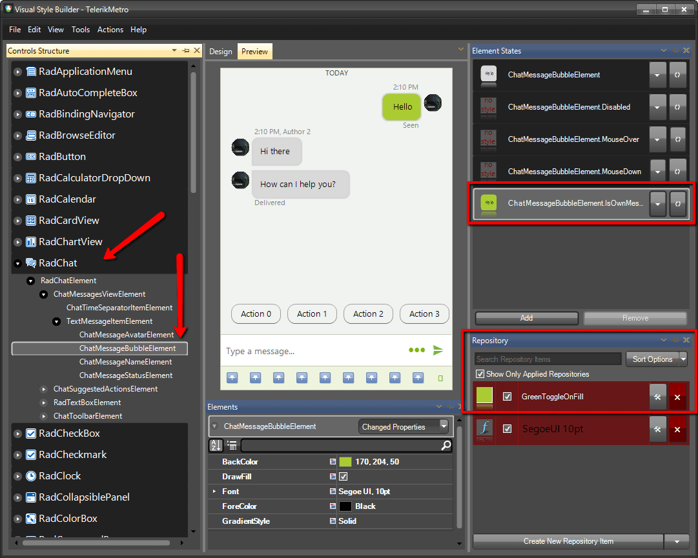
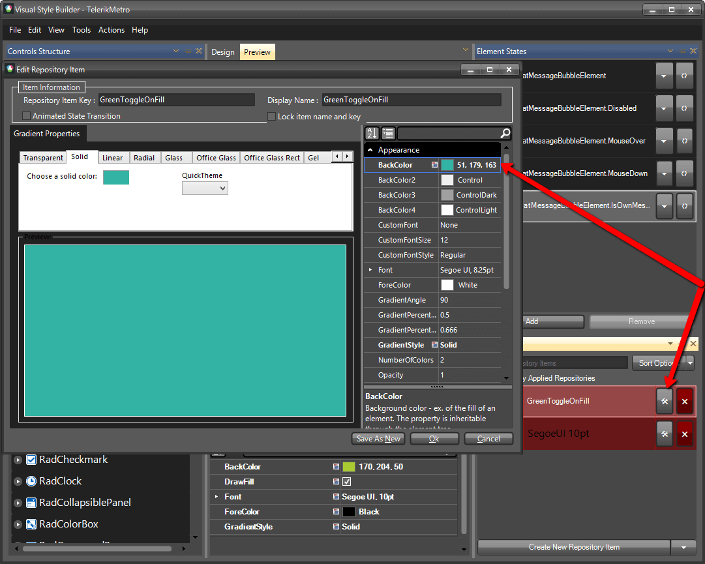
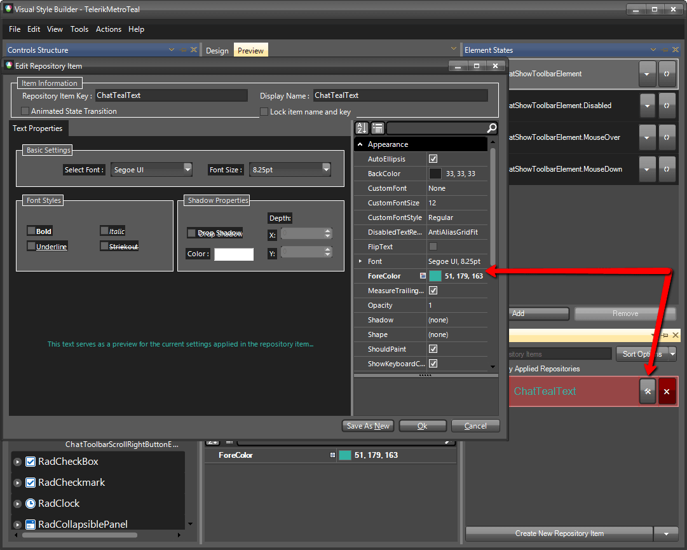
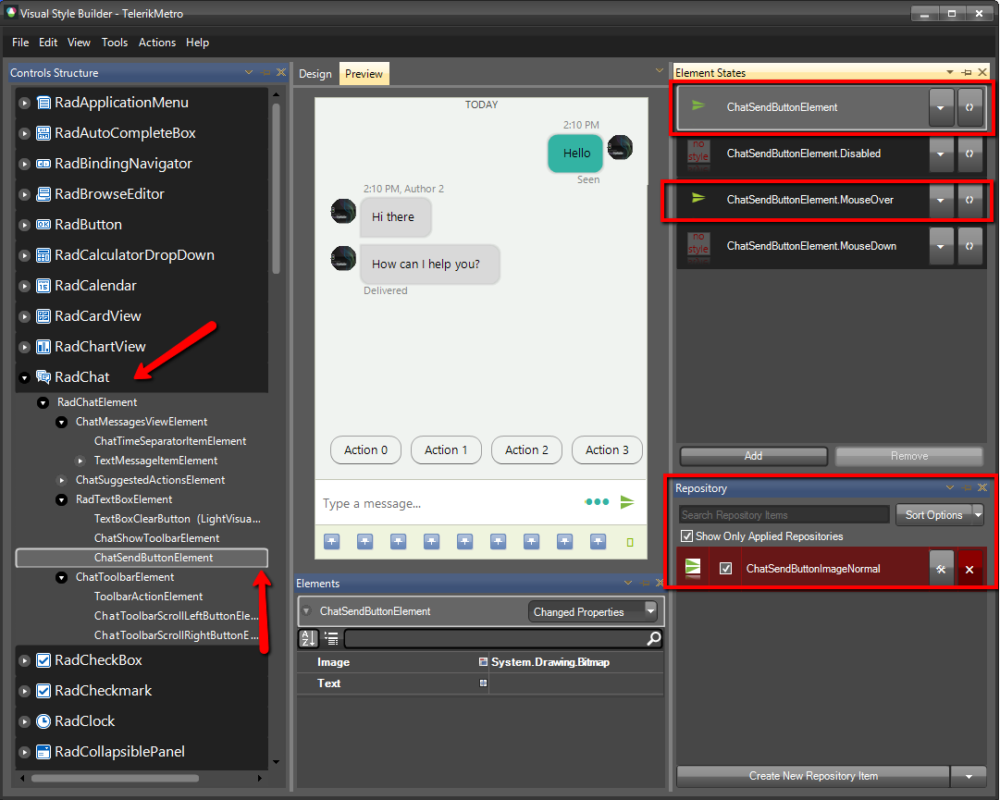
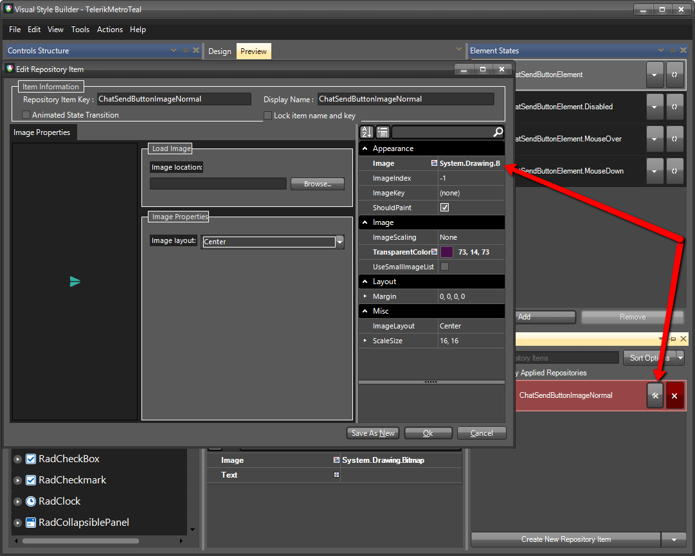
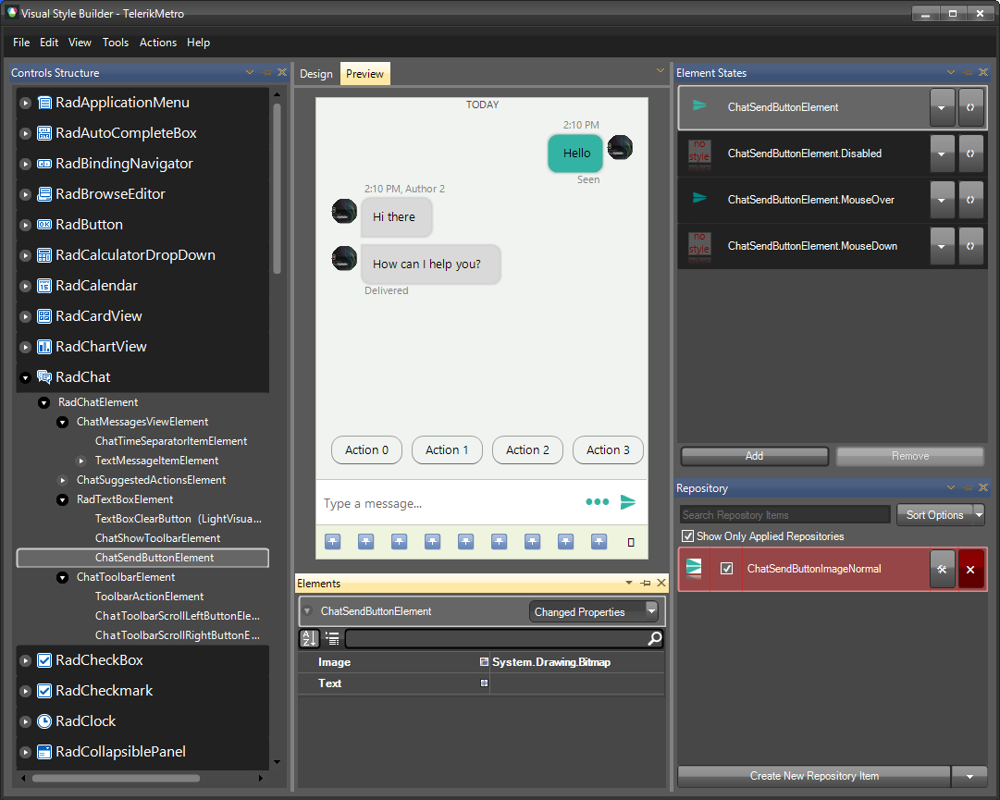

# Themes

This help article will demonstrate a step by step tutorial how to customize the `Metro` theme for **RadChat**

1. Open [Visual Style Builder] ()
2. Export the built-in themes in a specific folder by selecting `File` >> `Export Built-in Themes`.
3. Load a desired theme from the just exported files by selecting `File` >> `Open Package`.
4. Expand **RadChat** and select the `ChatMessageBubbleElement`. 
   

5. For the `IsOwnMessage` element state, open the `Edit Repository Item` dialog and change the `BackColor`:
   

6. Expand the **RadTextBoxElement** and select the `ChatShowToolbarElement`.
   

7. For the default and `MouseOver` element states, open the `Edit Repository Item` dialog and change the `ForeColor`:
   

8. Select the `ChatSendButtonElement`.
   

9. For the default and `MouseOver` element states, open the `Edit Repository Item` dialog and change the `Image`:
   

10. The bellow image shows the result.
   

>note The following article shows how you can use the new theme: [Using Custom Themes]().

# See Also

* [Structure]()
* [Accessing and Customizing Elements]()
