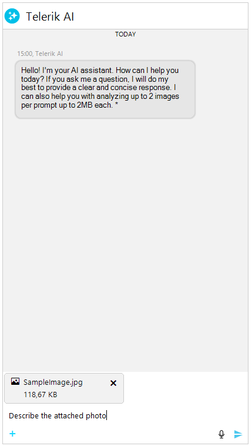
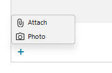
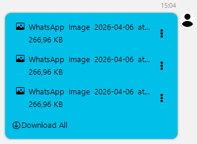

# WinForms Chat File Upload

__RadChat__ provides built-in file upload functionality that allows users to attach files and images to messages, preview them before sending, and download received files. The feature integrates with the existing `RadPromptInputElement` and uses the **More** button in the input area to trigger file selection.



## Overview

The file upload workflow in __RadChat__ consists of:

1. The user clicks the **Plus** button in the input area and selects **Attach File** or **Attach Photo**.
2. A file dialog opens for file selection.
3. Selected files appear in a preview area above the input buttons, showing file name, size, and a remove button.
4. When the user sends the message, the attached files are bundled into the `ChatTextMessage` alongside any typed text.
5. The message appears in the chat area with attachment rows showing file icon, name, size, and a context menu for download.

The attachment system uses the `PromptInputAttachedFile` class as the data model for each attached file. Messages with attachments are rendered by the `TextMessageItemElement`, which displays attachment rows (`ChatAttachmentRowElement`) below the message text.

## Enabling File Upload

File upload is available through the **More** button in the input area. To show the **More** button, set the `IsMoreButtonVisible` property to `true`:

#### __Showing the More button to enable file upload__

````C#
this.radChat1.IsMoreButtonVisible = true;
````
````VB.NET
Me.RadChat1.IsMoreButtonVisible = True
````

The **Plus** button provides two default actions: **Attach File** (all file types) and **Attach Photo** (image files only).



## Attaching Files Programmatically

You can add files to the input area programmatically through the `AttachedFiles` collection on the `PromptInputElement`:

#### __Adding a file attachment programmatically__

````C#
PromptInputAttachedFile file = new PromptInputAttachedFile(new System.IO.FileInfo(@"C:\Documents\report.pdf"));
this.radChat1.ChatElement.PromptInputElement.AttachedFiles.Add(file);
````
````VB.NET
Dim file As New PromptInputAttachedFile(New System.IO.FileInfo("C:\Documents\report.pdf"))
Me.RadChat1.ChatElement.PromptInputElement.AttachedFiles.Add(file)
````

You can also create a `PromptInputAttachedFile` manually by setting the `FileName`, `FileSize`, and `GetFileStream` properties:

#### __Creating an attachment from a stream__

````C#
PromptInputAttachedFile file = new PromptInputAttachedFile();
file.FileName = "data.json";
file.FileSize = 2048;
file.GetFileStream = () => new System.IO.MemoryStream(jsonBytes);
this.radChat1.ChatElement.PromptInputElement.AttachedFiles.Add(file);
````
````VB.NET
Dim file As New PromptInputAttachedFile()
file.FileName = "data.json"
file.FileSize = 2048
file.GetFileStream = Function() New System.IO.MemoryStream(jsonBytes)
Me.RadChat1.ChatElement.PromptInputElement.AttachedFiles.Add(file)
````

This approach is useful for server-based scenarios where the file content comes from a remote source.

## Input Area Preview

When files are attached, they appear in the `PromptInputAttachedFilesElement` area above the buttons panel. Each file shows its icon, name, and size, along with a remove button.

The `MaxVisibleAttachments` property controls how many attachment rows are visible before the area becomes scrollable:

#### __Setting the maximum visible attachments__

````C#
this.radChat1.MaxVisibleAttachments = 5;
````
````VB.NET
Me.RadChat1.MaxVisibleAttachments = 5
````

The default value is 3.

## Sending Messages with Attachments

When the user presses **Send** (or `Enter`), __RadChat__ creates a `ChatTextMessage` that includes both the typed text and the attached files. The `ChatTextMessage` constructor accepts an optional `IEnumerable<PromptInputAttachedFile>` parameter:

#### __Creating a message with attachments programmatically__

````C#
List<PromptInputAttachedFile> files = new List<PromptInputAttachedFile>
{
    new PromptInputAttachedFile(new System.IO.FileInfo(@"C:\Documents\report.pdf")),
    new PromptInputAttachedFile(new System.IO.FileInfo(@"C:\Images\photo.png"))
};

ChatTextMessage message = new ChatTextMessage("Here are the files", files, this.radChat1.Author, DateTime.Now);
this.radChat1.AddMessage(message);
````
````VB.NET
Dim files As New List(Of PromptInputAttachedFile)()
files.Add(New PromptInputAttachedFile(New System.IO.FileInfo("C:\Documents\report.pdf")))
files.Add(New PromptInputAttachedFile(New System.IO.FileInfo("C:\Images\photo.png")))

Dim message As New ChatTextMessage("Here are the files", files, Me.RadChat1.Author, DateTime.Now)
Me.RadChat1.AddMessage(message)
````

Messages can contain text only, attachments only, or both. When no text is provided, pass `null` as the message parameter.

## Chat Area Display

Sent messages with attachments are rendered by the `TextMessageItemElement`. Each attachment appears as a `ChatAttachmentRowElement` displaying:

* A file type icon
* The file name (truncated if too long)
* The file size (formatted in KB/MB)
* A context menu button with download options

When a message contains more than one attachment, a **Download All** button appears below the attachment rows.



## Download and Interaction

Each attachment row provides a context menu with a **Download** option. Clicking it triggers the `AttachmentActionRequested` event and, if not handled, shows a save file dialog.

### AttachmentActionRequested Event

The `AttachmentActionRequested` event fires when the user invokes an attachment action (Download or Share). Set `AttachmentActionEventArgs.Handled` to `true` to suppress the default behavior and provide custom handling:

#### __Handling the AttachmentActionRequested event__

````C#
this.radChat1.AttachmentActionRequested += this.OnAttachmentActionRequested;

private void OnAttachmentActionRequested(object sender, AttachmentActionEventArgs e)
{
    if (e.Action == AttachmentAction.Download)
    {
        // Custom download logic (for example, upload to server or open in browser)
        e.Handled = true;
    }
}
````
````VB.NET
AddHandler Me.RadChat1.AttachmentActionRequested, AddressOf Me.OnAttachmentActionRequested

Private Sub OnAttachmentActionRequested(sender As Object, e As AttachmentActionEventArgs)
    If e.Action = AttachmentAction.Download Then
        ' Custom download logic (for example, upload to server or open in browser)
        e.Handled = True
    End If
End Sub
````

The `AttachmentActionEventArgs` class provides the following properties:

| Property | Description |
|----|----|
| Attachment | The single `PromptInputAttachedFile` associated with the action. |
| Attachments | All attachments when the action applies to multiple files. |
| Action | The `AttachmentAction` enum value (Download or Share). |
| Handled | Set to `true` to suppress the default behavior. |
| IsMultiple | Indicates whether the action applies to multiple attachments. |

### AttachedFilesChanged Event

The `AttachedFilesChanged` event fires when files are added to or removed from the input area attachment collection:

#### __Handling the AttachedFilesChanged event__

````C#
this.radChat1.AttachedFilesChanged += this.OnAttachedFilesChanged;

private void OnAttachedFilesChanged(object sender, EventArgs e)
{
    int count = this.radChat1.ChatElement.PromptInputElement.AttachedFiles.Count;
    Console.WriteLine("Attached files count: " + count);
}
````
````VB.NET
AddHandler Me.RadChat1.AttachedFilesChanged, AddressOf Me.OnAttachedFilesChanged

Private Sub OnAttachedFilesChanged(sender As Object, e As EventArgs)
    Dim count As Integer = Me.RadChat1.ChatElement.PromptInputElement.AttachedFiles.Count
    Console.WriteLine("Attached files count: " & count.ToString())
End Sub
````

## PromptInputAttachedFile Properties

The `PromptInputAttachedFile` class is the data model for file attachments:

| Property | Type | Description |
|----|----|----|
| FileName | string | The display name of the attached file. |
| FileSize | long | The size of the file in bytes. |
| GetFileStream | Func&lt;Stream&gt; | A factory delegate that provides a stream for reading the file content. |
| Data | object | Custom user data associated with the attachment. |
| IsDownloading | bool | Indicates whether the file is currently being downloaded. The UI can reflect this state. |

## See Also

* [Overview]()
* [Getting Started]()
* [Speech-to-Text Integration]()
* [Toolbar]()
* [Properties, Methods, and Events]()
