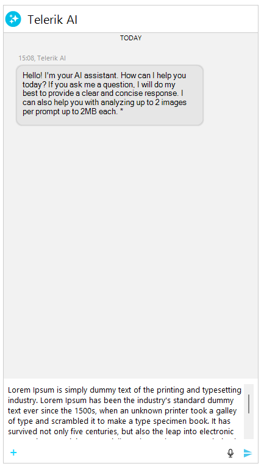
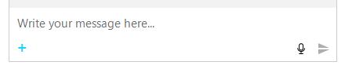

# WinForms Chat Multi-Line Input Editor

__RadChat__ features a multi-line input editor that automatically grows as the user types, accommodating longer messages without requiring manual resizing. The input text box starts as a single line and expands vertically up to a configurable maximum number of lines before displaying a scrollbar.



## Key Behaviors

The multi-line input editor in __RadChat__ provides the following behaviors:

* **Auto-grow** — the input area expands vertically as the user types or pastes text that wraps to new lines.
* **Maximum visible lines** — once the content exceeds the configured line limit (default: 5), a vertical scrollbar appears instead of further expanding.
* **Word wrap** — long lines wrap automatically within the available width.
* **New line insertion** — pressing `Shift+Enter` inserts a new line. Pressing `Enter` alone sends the message.

## Configuring Maximum Input Lines

The `MaxInputLines` property on the `InputTextBox` element controls how many lines the editor displays before showing a scrollbar. The default value is 5.

#### __Setting the maximum input lines__

````C#
ChatInputTextBoxElement inputBox = (ChatInputTextBoxElement)this.radChat1.ChatElement.InputTextBox;
inputBox.MaxInputLines = 8;
````
````VB.NET
Dim inputBox As ChatInputTextBoxElement = DirectCast(Me.RadChat1.ChatElement.InputTextBox, ChatInputTextBoxElement)
inputBox.MaxInputLines = 8
````

Setting `MaxInputLines` to 1 effectively disables auto-grow and keeps the input as a single-line text box with horizontal scrolling.

You can also access this property through the `PromptInputElement`:

#### __Setting maximum input lines via PromptInputElement__

````C#
this.radChat1.ChatElement.PromptInputElement.MaxInputLines = 10;
````
````VB.NET
Me.RadChat1.ChatElement.PromptInputElement.MaxInputLines = 10
````

## Keyboard Interaction

The multi-line editor uses the following keyboard shortcuts:

| Key Combination | Action |
|----|----|
| Enter | Sends the current message (text and any attached files). |
| Shift+Enter | Inserts a new line at the current caret position. |
| Ctrl+V | Pastes text content. If the clipboard contains an image, it is sent as a `ChatMediaMessage`. |

## Accessing the Input Text Box

The input text box is exposed as a `RadTextBoxElement` through the `RadChat.ChatElement.InputTextBox` property. The underlying implementation is the `ChatInputTextBoxElement` class which extends `RadTextBoxElement` with auto-grow capabilities.

#### __Accessing and customizing the input text box__

````C#
RadTextBoxElement inputTextBox = this.radChat1.ChatElement.InputTextBox;
inputTextBox.Font = new Font("Segoe UI", 11f);
inputTextBox.TextBoxItem.NullText = "Write your message here...";
````
````VB.NET
Dim inputTextBox As RadTextBoxElement = Me.RadChat1.ChatElement.InputTextBox
inputTextBox.Font = New Font("Segoe UI", 11.0F)
inputTextBox.TextBoxItem.NullText = "Write your message here..."
````



## See Also

* [Overview]()
* [Getting Started]()
* [Structure]()
* [Properties, Methods, and Events]()
