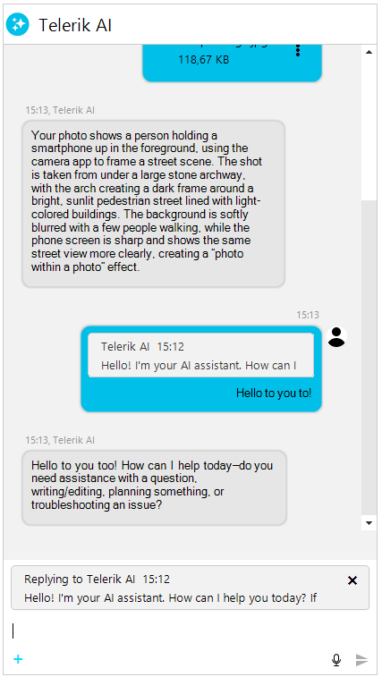
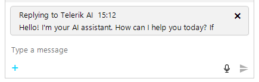

# WinForms Chat Replies

__RadChat__ supports replying to messages, allowing users to quote one or more previous messages when composing a response. Replies appear as compact bubbles above the message text, providing visual context about which messages the response addresses.



## Overview

The reply workflow in __RadChat__ consists of:

1. The user right-clicks a message and selects **Reply with quote** from the context menu.
2. A reply preview element appears above the input area, showing the quoted message.
3. The user types a response and sends the message.
4. The sent message displays with reply bubbles at the top of the message bubble, showing the quoted content.

Replies are stored in the `ChatMessage.ReplyToMessages` collection. Each message can reply to one or multiple messages (up to the configured `MaxReplyMessages` limit).

## Enabling and Disabling Replies

The reply functionality is controlled by the `EnableReplies` property on __RadChat__. By default, replies are enabled.

#### __Disabling the reply functionality__

````C#
this.radChat1.EnableReplies = false;
````
````VB.NET
Me.RadChat1.EnableReplies = False
````

When `EnableReplies` is set to `false`, the **Reply with quote** context menu item is hidden and programmatic `StartReply` calls are ignored.

## Starting a Reply

Users can start a reply through the message context menu. You can also start a reply programmatically using the `StartReply` method on `RadChatElement`:

#### __Starting a reply programmatically__

````C#
ChatMessage messageToReply = this.radChat1.ChatElement.MessagesViewElement.Items[0].Message;
this.radChat1.ChatElement.StartReply(messageToReply);
````
````VB.NET
Dim messageToReply As ChatMessage = Me.RadChat1.ChatElement.MessagesViewElement.Items(0).Message
Me.RadChat1.ChatElement.StartReply(messageToReply)
````

The `StartReply` method returns `true` if the message was successfully added to the reply list, or `false` if the limit was reached or the message was a duplicate.



## Multi-Message Replies

__RadChat__ supports replying to multiple messages at once. The `MaxReplyMessages` property controls the maximum number of messages that can be quoted in a single reply. The default value is 5.

#### __Configuring multi-message replies__

````C#
this.radChat1.ChatElement.MaxReplyMessages = 3;
````
````VB.NET
Me.RadChat1.ChatElement.MaxReplyMessages = 3
````

When `MaxReplyMessages` is set to 1, each new reply replaces the previous one instead of accumulating. When the value is greater than 1, selecting **Reply with quote** on additional messages adds them to the existing reply list.

## Canceling and Removing Replies

The user can cancel the reply by clicking the close button on the reply preview element. You can also cancel or modify replies programmatically:

#### __Canceling and removing replies programmatically__

````C#
// Cancel the entire reply operation
this.radChat1.ChatElement.CancelReply();

// Remove a specific message from a multi-reply
this.radChat1.ChatElement.RemoveFromReply(specificMessage);
````
````VB.NET
' Cancel the entire reply operation
Me.RadChat1.ChatElement.CancelReply()

' Remove a specific message from a multi-reply
Me.RadChat1.ChatElement.RemoveFromReply(specificMessage)
````

## Reply State Properties

The `RadChatElement` exposes several properties to inspect the current reply state:

| Property | Type | Description |
|----|----|----|
| IsReplyMode | bool | Indicates whether the chat is currently in reply mode. |
| IsMultiReplyMode | bool | Indicates whether the chat is replying to more than one message. |
| ReplyToMessage | ChatMessage | The first message being replied to, or null if not in reply mode. |
| ReplyToMessages | IReadOnlyList&lt;ChatMessage&gt; | All messages currently being replied to. |

## Message Reply Properties

The `ChatMessage` class exposes properties for inspecting reply relationships:

| Property | Type | Description |
|----|----|----|
| ReplyToMessages | IList&lt;ChatMessage&gt; | The list of messages this message is replying to. |
| ReplyToMessage | ChatMessage | Gets or sets the single message this replies to. Setting replaces the list. |
| IsReply | bool | Indicates whether this message is a reply. |
| IsMultiReply | bool | Indicates whether this message replies to more than one message. |
| ReplyToMessagesCount | int | The number of messages this message replies to. |
| ReplyToAuthor | Author | The author of the first replied-to message. |
| ReplyToAuthors | IEnumerable&lt;Author&gt; | The unique authors of all replied-to messages. |
| ReplyToMessagePreview | string | A truncated preview of the replied-to message text. |

## Events

The following events are available on `RadChatElement` for monitoring reply activity:

| Event | Description |
|----|----|
| ReplyStarted | Raised when the user starts replying to one or more messages. |
| ReplyCancelled | Raised when the reply operation is cancelled. |
| ReplyBubbleClicked | Raised when the user clicks a reply bubble in a sent message, allowing navigation to the original message. |

#### __Handling the ReplyStarted event__

````C#
this.radChat1.ChatElement.ReplyStarted += this.OnReplyStarted;

private void OnReplyStarted(object sender, ReplyEventArgs e)
{
    Console.WriteLine("Replying to " + e.Messages.Count + " message(s)");
}
````
````VB.NET
AddHandler Me.RadChat1.ChatElement.ReplyStarted, AddressOf Me.OnReplyStarted

Private Sub OnReplyStarted(sender As Object, e As ReplyEventArgs)
    Console.WriteLine("Replying to " & e.Messages.Count.ToString() & " message(s)")
End Sub
````

## Creating Reply Messages Programmatically

You can create a message that is a reply to another message by populating the `ReplyToMessages` collection:

#### __Creating a reply message programmatically__

````C#
ChatTextMessage originalMessage = new ChatTextMessage("What time is the meeting?", otherAuthor, DateTime.Now.AddMinutes(-5));
this.radChat1.AddMessage(originalMessage);

ChatTextMessage replyMessage = new ChatTextMessage("The meeting is at 3 PM.", this.radChat1.Author, DateTime.Now);
replyMessage.ReplyToMessages.Add(originalMessage);
this.radChat1.AddMessage(replyMessage);
````
````VB.NET
Dim originalMessage As New ChatTextMessage("What time is the meeting?", otherAuthor, DateTime.Now.AddMinutes(-5))
Me.RadChat1.AddMessage(originalMessage)

Dim replyMessage As New ChatTextMessage("The meeting is at 3 PM.", Me.RadChat1.Author, DateTime.Now)
replyMessage.ReplyToMessages.Add(originalMessage)
Me.RadChat1.AddMessage(replyMessage)
````

The reply message renders with a quoted bubble above the message text showing the original message content and author.

## See Also

* [Overview]()
* [Getting Started]()
* [Messages]()
* [Properties, Methods, and Events]()
