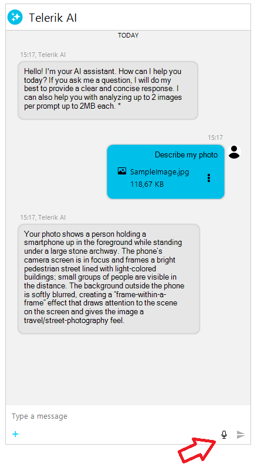

# WinForms Chat Speech-to-Text Integration

__RadChat__ provides built-in speech-to-text functionality that allows users to dictate messages using their microphone. The feature leverages the `RadSpeechToTextButtonElement` component, which is integrated into the chat input area through the `RadPromptInputElement`.

>important The speech-to-text feature requires the **WebView2** runtime to be installed on the end user machine. Ensure that your application includes the `Microsoft.Web.WebView2` NuGet package as a dependency.

## Overview

The speech-to-text button is positioned in the input area buttons panel, alongside the send button. When clicked, it activates the speech recognizer which listens for voice input and inserts the recognized text into the chat input text box. The recognized text is inserted at the current caret position, allowing users to combine typed and dictated input seamlessly.



The integration supports:

* **Continuous recognition mode** — the recognizer listens continuously until explicitly stopped.
* **Single utterance mode** — the recognizer stops automatically after a pause in speech.
* **Configurable language** — specify the recognition language via a BCP 47 language tag.
* **Visual state feedback** — the button animates while actively listening.

## Removing the Speech-to-Text Button

The speech-to-text button visibility is controlled by the `IsSpeechToTextButtonVisible` property on __RadChat__. By default, this property is set to `true`.

#### __Toggling the speech-to-text button visibility__

````C#
this.radChat1.IsSpeechToTextButtonVisible = false;
````
````VB.NET
Me.RadChat1.IsSpeechToTextButtonVisible = False
````

## Configuring the Speech Recognizer

You can configure the speech recognition behavior through the `RadSpeechToTextButtonElement` exposed by the prompt input element. Access it via the `RadChat.ChatElement.PromptInputElement.ButtonsPanelElement.SpeechToTextButton` property path.

### Language Tag

Set the `LanguageTag` property to specify the recognition language using an IETF BCP 47 tag (for example, "en-US", "de-DE", "fr-FR").

#### __Setting the recognition language__

````C#
RadSpeechToTextButtonElement sttButton = this.radChat1.ChatElement.PromptInputElement.ButtonsPanelElement.SpeechToTextButton;
sttButton.LanguageTag = "de-DE";
````
````VB.NET
Dim sttButton As RadSpeechToTextButtonElement = Me.RadChat1.ChatElement.PromptInputElement.ButtonsPanelElement.SpeechToTextButton
sttButton.LanguageTag = "de-DE"
````

### Continuous Recognition

The `IsContinuousRecognition` property determines whether the recognizer listens continuously or stops after a single utterance. The default value is `true`.

#### __Disabling continuous recognition__

````C#
RadSpeechToTextButtonElement sttButton = this.radChat1.ChatElement.PromptInputElement.ButtonsPanelElement.SpeechToTextButton;
sttButton.IsContinuousRecognition = false;
````
````VB.NET
Dim sttButton As RadSpeechToTextButtonElement = Me.RadChat1.ChatElement.PromptInputElement.ButtonsPanelElement.SpeechToTextButton
sttButton.IsContinuousRecognition = False
````

When continuous recognition is disabled, the recognizer stops automatically after a single utterance or pause in speech.

## Events

The `RadSpeechToTextButtonElement` exposes the following events relevant to the chat integration:

| Event | Description |
|----|----|
| SpeechRecognized | Raised when the speech recognizer successfully recognizes speech. The recognized text is automatically inserted into the input text box. |
| StateChanged | Raised when the recognizer state changes (for example, from Ready to Listening, or from Listening to StoppingListening). |
| ErrorOccurred | Raised when an error is encountered during speech recognition initialization or processing. |

### Handling the SpeechRecognized Event

You can subscribe to the `SpeechRecognized` event to perform custom logic when the recognizer produces a result.

#### __Subscribing to the SpeechRecognized event__

````C#
RadSpeechToTextButtonElement sttButton = this.radChat1.ChatElement.PromptInputElement.ButtonsPanelElement.SpeechToTextButton;
sttButton.SpeechRecognized += this.OnSpeechRecognized;

private void OnSpeechRecognized(object sender, SpeechRecognizerSpeechRecognizedEventArgs e)
{
    // e.Text contains the recognized speech
    Console.WriteLine("Recognized: " + e.Text);
}
````
````VB.NET
Dim sttButton As RadSpeechToTextButtonElement = Me.RadChat1.ChatElement.PromptInputElement.ButtonsPanelElement.SpeechToTextButton
AddHandler sttButton.SpeechRecognized, AddressOf Me.OnSpeechRecognized

Private Sub OnSpeechRecognized(sender As Object, e As SpeechRecognizerSpeechRecognizedEventArgs)
    ' e.Text contains the recognized speech
    Console.WriteLine("Recognized: " & e.Text)
End Sub
````

### Handling the ErrorOccurred Event

Subscribe to the `ErrorOccurred` event to handle initialization failures or runtime errors gracefully.

#### __Subscribing to the ErrorOccurred event__

````C#
RadSpeechToTextButtonElement sttButton = this.radChat1.ChatElement.PromptInputElement.ButtonsPanelElement.SpeechToTextButton;
sttButton.ErrorOccurred += this.OnSpeechToTextError;

private void OnSpeechToTextError(object sender, SpeechRecognizerErrorOccurredEventArgs e)
{
    RadMessageBox.Show("Speech recognition error: " + e.ErrorMessage);
}
````
````VB.NET
Dim sttButton As RadSpeechToTextButtonElement = Me.RadChat1.ChatElement.PromptInputElement.ButtonsPanelElement.SpeechToTextButton
AddHandler sttButton.ErrorOccurred, AddressOf Me.OnSpeechToTextError

Private Sub OnSpeechToTextError(sender As Object, e As SpeechRecognizerErrorOccurredEventArgs)
    RadMessageBox.Show("Speech recognition error: " & e.ErrorMessage)
End Sub
````

## Speech Recognizer States

The button reflects the current state of the speech recognizer through visual feedback. The following table lists all possible states:

| State | Description |
|----|----|
| NotInitialized | The recognizer has not been initialized yet. |
| Ready | The recognizer is initialized and ready to start listening. |
| StartingListening | The recognizer is transitioning to the listening state. |
| Listening | The recognizer is actively listening for speech input. The button shows a pulse animation. |
| StoppingListening | The recognizer is transitioning from listening to ready. |
| Faulted | An error occurred during recognition. |

## Requirements

* The `Microsoft.Web.WebView2` NuGet package must be referenced by the project.
* The WebView2 runtime must be available on the target machine.
* A working microphone must be connected and accessible to the application.

## See Also

* [Overview]()
* [Getting Started]()
* [Structure]()
* [Properties, Methods, and Events]()                                            
