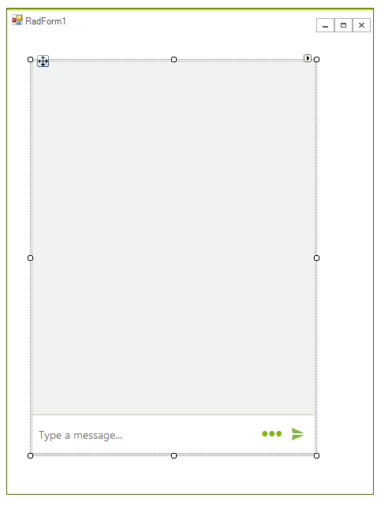
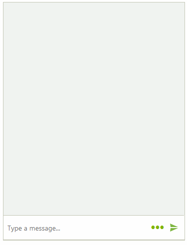

# Getting Started with WinForms Chat

This article will give you getting started experience with **RadChat**. 

1\. To start using **RadChat** just drag it from the toolbox and drop it onto the form:

 

2\. Set the RadChat.**Author** property: 

#### Setting default author

{{source=..\SamplesCS\Chat\ChatGettingStarted.cs region=SetAuthor}} 
{{source=..\SamplesVB\Chat\ChatGettingStarted.vb region=SetAuthor}}

````C#
this.radChat1.Author = new Author(Properties.Resources.architect, "Ben");

````
````VB.NET
Me.radChat1.Author = New Author(My.Resources.architect, "Ben")

```` 


{{endregion}}

Now, you are ready to start sending messages:

 

By default, when you enter some input in the text box and press the `Enter` key to confirm the message, it is automatically added to **RadChat**. This is controlled by the RadChat.**AutoAddUserMessages** property which default value is *true*.  Once a message is confirmed either by pressing the `Enter` key or by clicking the arrow sign, the RadChat.**SendMessage** event is fired. 

If the RadChat.**AutoAddUserMessages** property is set to *false* the message from the text box won't be automatically added to the messages' view. In the **SendMessage** event you can add the message programmatically. 

#### Adding message programmatically

{{source=..\SamplesCS\Chat\ChatGettingStarted.cs region=AddMessage}} 
{{source=..\SamplesVB\Chat\ChatGettingStarted.vb region=AddMessage}}

````C#
        
private void AddMessageProgrammatically()
{
    this.radChat1.AutoAddUserMessages = false;
    this.radChat1.SendMessage += radChat1_SendMessage;
}
        
private void radChat1_SendMessage(object sender, SendMessageEventArgs e)
{
    ChatTextMessage textMessage = e.Message as ChatTextMessage;
    textMessage.Message = "[Slightly changed message] " + textMessage.Message;
    this.radChat1.AddMessage(textMessage);
}

````
````VB.NET
Private Sub AddMessageProgrammatically()
    Me.radChat1.AutoAddUserMessages = False
    AddHandler Me.radChat1.SendMessage, AddressOf radChat1_SendMessage
End Sub
Private Sub radChat1_SendMessage(ByVal sender As Object, ByVal e As SendMessageEventArgs)
    Dim textMessage As ChatTextMessage = TryCast(e.Message, ChatTextMessage)
    textMessage.Message = "[Slightly changed message] " & textMessage.Message
    Me.radChat1.AddMessage(textMessage)
End Sub

```` 


{{endregion}}

 

# See Also

* [Overview]()
* [Messages]()
* [Cards]()
* [Overlays]()
* [Suggested Actions]()
 
        

## Telerik UI for WinForms Learning Resources
* [Telerik UI for WinForms Chat Component](https://www.telerik.com/products/winforms/conversational-ui.aspx)
* [Getting Started with Telerik UI for WinForms Components](https://docs.telerik.com/devtools/winforms/getting-started/first-steps)
* [Telerik UI for WinForms Setup](https://docs.telerik.com/devtools/winforms/installation-and-upgrades/installing-on-your-computer)
* [Telerik UI for WinForms Application Modernization](https://docs.telerik.com/devtools/winforms/winforms-converter/overview)
* [Telerik UI for WinForms Visual Studio Templates](https://docs.telerik.com/devtools/winforms/visual-studio-integration/visual-studio-templates)
* [Deploy Telerik UI for WinForms Applications](https://docs.telerik.com/devtools/winforms/deployment-and-distribution/application-deployment)
* [Telerik UI for WinForms Virtual Classroom(Training Courses for Registered Users)](https://learn.telerik.com/learn/course/external/view/elearning/17/telerik-ui-for-winforms)
* [Telerik UI for WinForms License Agreement)](https://www.telerik.com/purchase/license-agreement/winforms-dlw-s)

