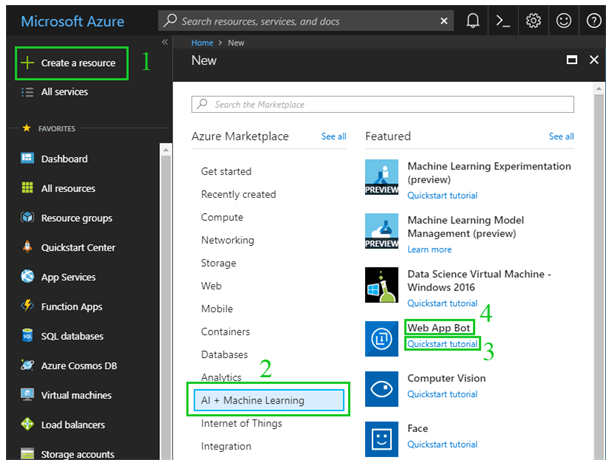
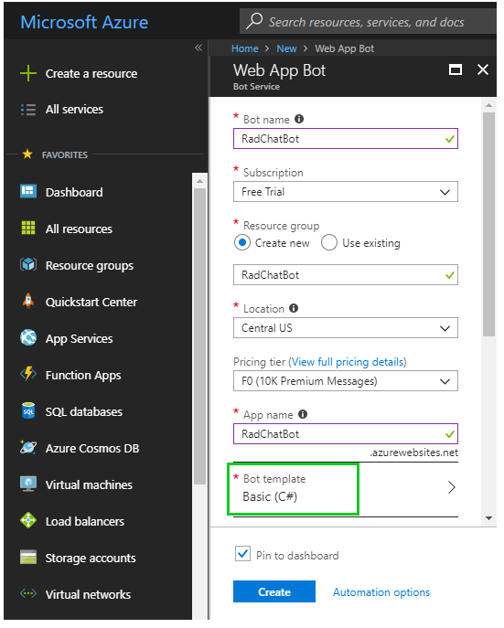
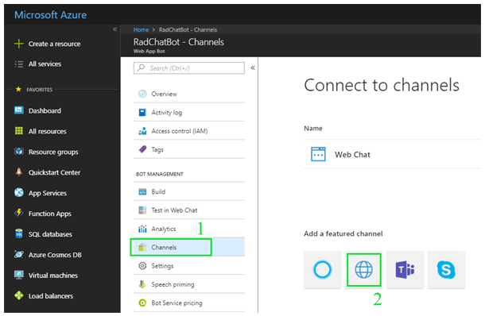
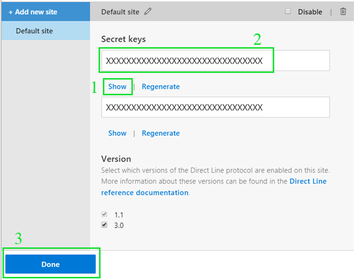
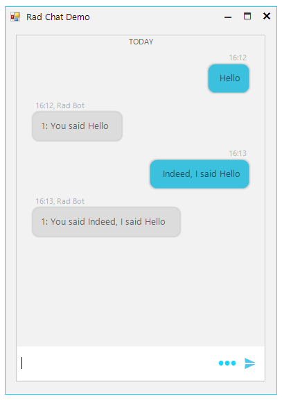

# Creating an Azure Chat Bot using Microsoft Bot Framework and the DirectLine channel

The idea of this tutorial is to show you how you can quickly build a chat bot with Bot Framework and connect it to **RadChat**.

Every journey has a starting point and this one starts at [azure.com](https://azure.microsoft.com/en-us/). The first thing we need is a **Microsoft account** and an **Azure subscription**. If you already have one you can use it, if you don't you can create a free one.

Once we have our account and subscription our journey goes to the [Azure portal](https://portal.azure.com/). Here we will create and manage the app for our bot. We can even edit the source code of our bot right in the browser, but let's not get ahead of ourselves. First, go to *“Create a Resource” (1)*. If this is your first time in the portal you will have the option right in your dashboard, in all cases you can use the button on the menu on left hand side. The type of resource we are interested in is called *“Web App Bot” (4)* which can be found under the “*AI + Machine Learning” group (2)*. Note that clicking on *(3)* is optional but will help you understand the next window.



On the next step, fill in the required fields and leave the Bot Template to “*Basic (C#)*” then hit **Create**. This will create an echo bot that will repeat back any messages we send to it.



In a few moments the bot app will be deployed and we will be ready for the channel setup.

When we open our newly created app, the only way to reach it is through Web chat. To enable DirectLine, which will be our channel of communication, click on the **Channels** option *(1)* and then on the **DirectLine** button *(2)*.



After you enable the channel the channel's settings dialog will open. Since we are there and we are close to being done with the part of the project on the Azure portal side, you can hit **Show** *(1)* on either secret key and then copy the actual secret from the text box *(2)*. In the end hit **Done** *(3)* and we are done with the setup.



If you ever need to come back to this dialog you can hit the **Edit** button in the channels list.

Now, we will create a new WinForms project in Visual Studio and open the *app.config* file. Inside it we will place the secret we just copied and the bot id. The bot id will usually be the same as your app name but to be on the safe side you can go to *Application Settings* in your app options and scroll through the options you should be able to find it. Here is how the *app.config* looks like:

````xml
<?xml version="1.0" encoding="utf-8" ?>
<configuration>
  <appSettings>
    <add key="DirectLineSecret" value="<YOUR_DIRECTLINE_SECRET>" />
    <add key="BotId" value="RadChatBot" />
  </appSettings>
  <startup>
    <supportedRuntime version="v4.0" sku=".NETFramework,Version=v4.7.1" />
  </startup>
</configuration>
````

Now, we need to add references to the necessary assemblies. Go to the *Solution Explorer* of your Visual Studio, right click on the new project and click “**Manage NuGet Packages**”. In the “*browse*” section search for “*Microsoft.Bot.Connector.DirectLine*” and hit install. Then, repeat for the “*websocket-sharp*” package. After installing the NuGet packages, you can update the ones that have newer versions if you want to.

Next, we place a **RadChat** control on the main form and we can begin writing code.

We start by defining some fields. I will place all the code and explain the purpose of it below:

````C#
private readonly string directLineSecret = ConfigurationManager.AppSettings["DirectLineSecret"];
private readonly string botId = ConfigurationManager.AppSettings["BotId"];
 
private WebSocket webSocketClient;
private DirectLineClient directLineClient;
private Conversation conversation;
 
private Author client = new Author(null, "Client", "ClientId");
private Author bot = new Author(null, "Rad Bot");
````

The first two lines read the settings we placed in the *app.config* file and store them into variables. The web socket client is used for listening for messages from the server. The direct line client helps with starting the conversation and sending messages to the server. The conversation is used to hold information for the current conversation. The two authors are there, so **RadChat** can display the messages from both parties appropriately.

Next, we have the initialization code in the form's constructor. Again, here is the code and the explanation follows:

````C#
public Form1()
{
  InitializeComponent();

  Conversation tokenResponse = new DirectLineClient(directLineSecret).Tokens.GenerateTokenForNewConversation();
  this.directLineClient = new DirectLineClient(tokenResponse.Token);
  this.conversation = directLineClient.Conversations.StartConversation();

  this.webSocketClient = new WebSocket(conversation.StreamUrl);
  this.webSocketClient.OnMessage += WebSocketClient_OnMessage;
  this.webSocketClient.Connect();

  this.radChat1.Author = this.client;
  this.radChat1.ChatElement.SendMessage += this.ChatElement_SendMessage;
}
````

Here we have the standard code for starting a conversation through the DirectLine API, then we have the code for receiving messages from the server and finally the code for getting the user messages from **RadChat**. Note that we set the client author to the chat control so that **RadChat** knows who is the author of the messages written in its input field.

Now let's consider the code for receiving messages from the server and displaying them in the chat control:

````C#
private void WebSocketClient_OnMessage(object sender, MessageEventArgs e)
{
  // Occasionally, the Direct Line service sends an empty message as a liveness ping. Ignore these messages.
  if (string.IsNullOrWhiteSpace(e.Data))
  {
    return;
  }

  if (this.radChat1.InvokeRequired)
  {
    this.Invoke(new MethodInvoker(delegate { this.AddMessageToChat(e.Data); }));
  }
  else
  {
    this.AddMessageToChat(e.Data);
  }
}

private void AddMessageToChat(string data)
{
  var activitySet = JsonConvert.DeserializeObject<ActivitySet>(data);
  var activities = from x in activitySet.Activities
                   where x.From.Id == botId
                   select x;

  foreach (Activity activity in activities)
  {
    if (activity.Type == ActivityTypes.Message && !string.IsNullOrEmpty(activity.Text))
    {
      this.radChat1.ChatElement.AddMessage(new ChatTextMessage(activity.Text, this.bot, DateTime.Now));
    }
  }
}
````

Here it is a matter of getting the right elements from the JSON that the web app sends and then adding the message to **RadChat**.

The final part of the code deals with sending messages from the user through **RadChat** to the server:

````C#
private void ChatElement_SendMessage(object sender, SendMessageEventArgs e)
{
  string message = ((ChatTextMessage)e.Message).Message;

  Activity userMessage = new Activity
  {
    From = new ChannelAccount(name: this.client.Name),
    Text = message,
    Type = ActivityTypes.Message
  };

  directLineClient.Conversations.PostActivityAsync(conversation.ConversationId, userMessage);
}
````

With this our journey concludes. All the steps and code to have a working chat bot brought us here and now we can start the application and send a message to the bot which he should echo it back.



# See Also

* [Structure]()
* [Getting Started]()
* [Messages]()
* [Cards]()
* [Overlays]()
* [Suggested Actions]()
 
        
