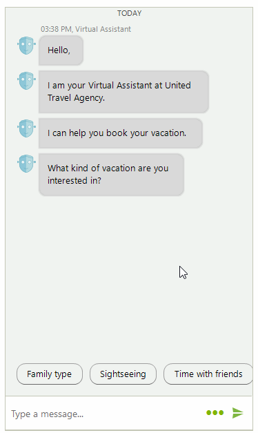
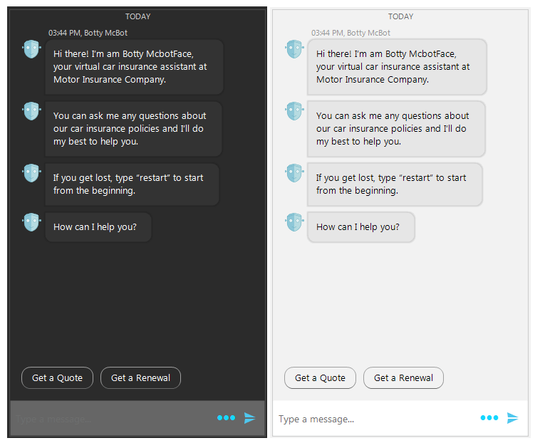

# WinForms Chat Overview

Since **R2 2018** Telerik UI for WinForms suite offers **RadChat** control. This control provides rich conversational experience that goes beyond the natural language understanding and personality of your chatbot. This allows developers to easily implement conversational UI in their applications by utilizing AI powered framework that works with natural language processing, by following a predefined logical tree, or just for integrating P2P chat capabilities in their applications. 

 

## Key Features

- Integration with all the major conversational UI APIs or services available today – Microsoft Bot, Google’s API.AI, Amazon LEX, and more. You can refer to our Demo Application >> Chat UI examples. 
- A variety of chat items for better user experience:
	* [Messages](): simple message, media message, carousel messages, time separator
	* [Cards](): product cards, flight cards, weather cards, etc.
	* [Overlays](): calendar, time picker, list, etc.
	* [Suggested Actions]()
- Highly customizable message and card content.
- [Toolbar]() which allows adding custom actions (adding an image for example).
- Predefined themes.

	 	

## Telerik UI for WinForms Learning Resources
* [Telerik UI for WinForms Chat Homepage](https://www.telerik.com/products/winforms/conversational-ui.aspx)
* [Get Started with the Telerik UI for WinForms Chat]()
* [Telerik UI for WinForms API Reference](https://docs.telerik.com/devtools/winforms/api/)
* [Getting Started with Telerik UI for WinForms Components]()
* [Telerik UI for WinForms Virtual Classroom (Training Courses for Registered Users)](https://learn.telerik.com/learn/course/external/view/elearning/17/TelerikUIforWinForms) 
* [Telerik UI for WinForms Forum](https://www.telerik.com/forums/winforms)
* [Telerik UI for WinForms Knowledge Base](https://docs.telerik.com/devtools/winforms/knowledge-base)

# See Also

* [Structure]()
* [Getting Started]()
* [Messages]()
* [Cards]()
* [Overlays]()
* [Suggested Actions]()
 
        
