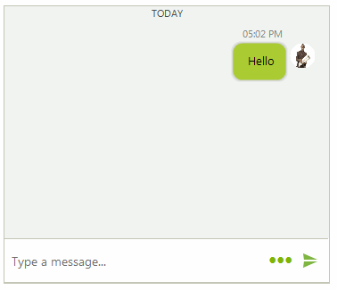
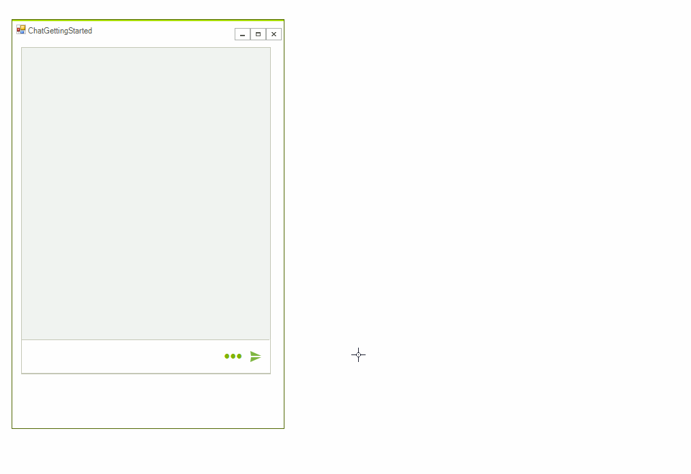

# Toolbar 

**ChatToolbarElement** allows adding different toolbar actions for achieving more user friendly conversational UI. It is placed below the text box and it can be shown/hidden by clicking the toolbar icon in the editable part:

>caption Figure 1. ChatToolbarElement

 
 
The below sample code demonstrates how to add a toolbar action that inserts an image selected from the File Explorer:

#### Adding ToolbarActionDataItem

<snippet id='chat-toolbar-toolbar-cs'/>
<snippet id='chat-toolbar-toolbar-vb'/>

>caption Figure 2. Inserting an image from a toolbar action

 

# See Also

* [Overview]()
* [Messages]()
* [Cards]()
* [Overlays]()
* [Suggested Actions]()
