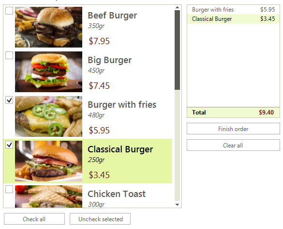

# WinForms CheckedListBox Overview

__RadCheckedListBox__ is an enhanced alternative to the standard Windows Forms checked list box control. __RadCheckedListBox__ uses a [RadListView]() as a foundation. All previous functionality is preserved (visual formatting and data binding) and is now extended. The control also has a very powerful Visual Studio designer.





>caption Figure 1: RadCheckedListBox

## Telerik UI for WinForms Learning Resources
* [Telerik UI for WinForms CheckedListBox Homepage](https://www.telerik.com/products/winforms/checkedlistbox.aspx)
* [Get Started with the Telerik UI for WinForms CheckedListBox]()
* [Telerik UI for WinForms API Reference](https://docs.telerik.com/devtools/winforms/api/)
* [Getting Started with Telerik UI for WinForms Components]()
* [Telerik UI for WinForms Virtual Classroom (Training Courses for Registered Users)](https://learn.telerik.com/learn/course/external/view/elearning/17/TelerikUIforWinForms) 
* [Telerik UI for WinForms Forum](https://www.telerik.com/forums/winforms)
* [Telerik UI for WinForms Knowledge Base](https://docs.telerik.com/devtools/winforms/knowledge-base)

# See Also

* [Getting Started]()
* [Structure]()
* [Desing Time]()
