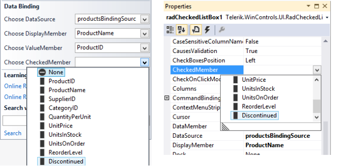
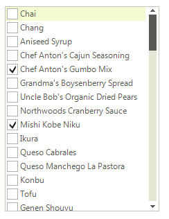
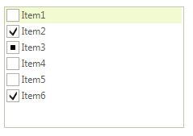

# Data Binding

## Supported Bindable Types

As an inheritor of __RadListView__, __RadCheckedListBox__ extends its functionality and provides a way to bind your __RadCheckedListBox__ check boxes to a data source. There are several types of data that __CheckedMember__ can be bound to:

* __Boolean__ – *True* represents ToggleState.*On* and *False* – ToggleState.*Off*.
            

* __Numeric__ – *0* represents ToggleState.*Off*, any other value is calculated as ToggleState.*On*.
            

* __ToggleState__ enumeration.
            

* __CheckState__ enumeration.
            

* __String__ – representing CheckBox ToggleState.*On* state with values like: "True", "On" and "T", ToggleState.*Indeterminate* state with value "indeterminate", ToggleState.*Off* state with any other value.
            

>note Information about __RadListView__ data binding is available here: [RadListView Data Binding]().
>

## Design Time

To data bind the checkboxes of __RadCheckedListBox__ you need to set __CheckedMember__ using the smart tag or the properties window. 

The result is data bound __CheckedListBox__

## Binding Programmatically

The following example demonstrates how you can bind the control by using the __CheckedMember__ property. This example uses the __CheckState__ property of the business object.
          

1\. Initially let’s create a collection of objects.

<snippet id='checkedlistbox-checkedlistboxdatabinding-simpleobject-cs' />
<snippet id='checkedlistbox-checkedlistboxdatabinding-simpleobject-vb' />

<snippet id='checkedlistbox-checkedlistboxdatabinding-createsimpleobjects-cs' />
<snippet id='checkedlistbox-checkedlistboxdatabinding-createsimpleobjects-vb' />

2\. To support three state check boxes we need to set the __ThreeStateMode__ property:
            

<snippet id='checkedlistbox-checkedlistboxdatabinding-threestatemode-cs' />
<snippet id='checkedlistbox-checkedlistboxdatabinding-threestatemode-vb' />

3\. And finally set programmatically the <b>DataSource</b>, <b>DisplayMember</b>, <b>ValueMember</b> and __CheckedMember__ properties. 

<snippet id='checkedlistbox-checkedlistboxdatabinding-programaticallydatabind-cs' />
<snippet id='checkedlistbox-checkedlistboxdatabinding-programaticallydatabind-vb' />

