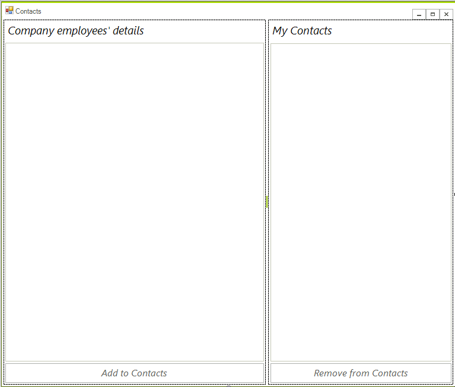
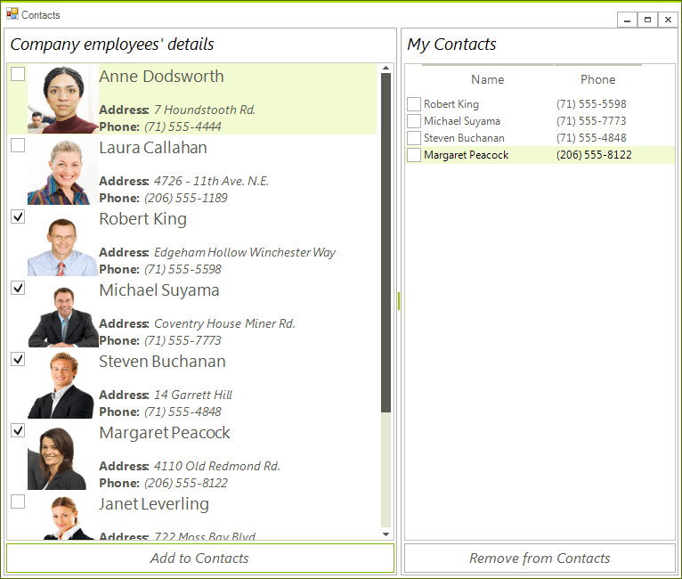

# Getting Started with WinForms CheckedListBox

You can add __RadCheckedListBox__ either at design time or at run time:

## Adding Telerik Assemblies Using NuGet

To use `RadCheckedListBox` when working with NuGet packages, install the `Telerik.UI.for.WinForms.AllControls` package. The [package target framework version may vary]().

Read more about NuGet installation in the [Install using NuGet Packages]() article.

>tip With the 2025 Q1 release, the Telerik UI for WinForms has a new licensing mechanism. You can learn more about it [here]().

## Adding Assembly References Manually

When dragging and dropping a control from the Visual Studio (VS) Toolbox onto the Form Designer, VS automatically adds the necessary assemblies. However, if you're adding the control programmatically, you'll need to manually reference the following assemblies:

* __Telerik.Licensing.Runtime__
* __Telerik.WinControls__
* __Telerik.WinControls.UI__
* __TelerikCommon__

The Telerik UI for WinForms assemblies can be install by using one of the available [installation approaches](). 

## Defining the RadCheckedListBox

You can add __RadCheckedListBox__ either at design time or at run time:

### Design Time

1. To add a __RadCheckedListBox__ to your form, drag a __RadCheckedListBox__ from the toolbox onto the surface of the form designer.
2. In the *Properties* section in Visual Studio open the __Items__ property.
3. Add several items by clicking the `Add` button.
4. Click `F5` to start the application.

### Run Time

To programmatically add a __RadCheckedListBox__ to a form, create a new instance of a __RadCheckedListBox__, and add it to the form __Controls__ collection.

#### Adding a RadCheckedListBox at runtime 

<snippet id='checkedlistbox-checkedlistboxgettingstarted-creatingcontrol-cs' />
<snippet id='checkedlistbox-checkedlistboxgettingstarted-creatingcontrol-vb' />

The bellow example demonstrates the main capabilities of __RadCheckedListBox__.
        

1\. Drop a __RadSplitContainer__ on your form and set its __Dock__ property to *Fill* .
            

2\. Add two panels to the split container. For example by using the smart tag.
            

3\. Add  __RadLabel__, __RadCheckedListBox__ and a __RadButton__ to each of the panels. At this point the form should look like this: 

4\. Now you are ready to bind the control. Open the code behind and add the following:  

<snippet id='checkedlistbox-checkedlistboxgettingstarted-initialization-cs' />
<snippet id='checkedlistbox-checkedlistboxgettingstarted-initialization-vb' />

5\. The example uses the following sample business object: 
	

<snippet id='checkedlistbox-checkedlistboxgettingstarted-phonebookentry-cs' />
<snippet id='checkedlistbox-checkedlistboxgettingstarted-phonebookentry-vb' />

6\. Now you can create a collection of PhonebookEntry business objects:

<snippet id='checkedlistbox-checkedlistboxgettingstarted-createphonebookentries-cs' />
<snippet id='checkedlistbox-checkedlistboxgettingstarted-createphonebookentries-vb' />

7\. The next step is to create click event handlers for the buttons:

<snippet id='checkedlistbox-checkedlistboxgettingstarted-clickevents-cs' />
<snippet id='checkedlistbox-checkedlistboxgettingstarted-clickevents-vb' />

8\. The final step is to use the __VisualItemFormatting__ event to style the items in the first __RadCheckedListBox__. Please note that the checkbox position is changed.
            
<snippet id='checkedlistbox-checkedlistboxgettingstarted-visualitemformatting-cs' />
<snippet id='checkedlistbox-checkedlistboxgettingstarted-visualitemformatting-vb' />

## Telerik UI for WinForms Learning Resources
* [Telerik UI for WinForms CheckedListBox Component](https://www.telerik.com/products/winforms/checkedlistbox.aspx)
* [Getting Started with Telerik UI for WinForms Components](https://docs.telerik.com/devtools/winforms/getting-started/first-steps)
* [Telerik UI for WinForms Setup](https://docs.telerik.com/devtools/winforms/installation-and-upgrades/installing-on-your-computer)
* [Telerik UI for WinForms Application Modernization](https://docs.telerik.com/devtools/winforms/winforms-converter/overview)
* [Telerik UI for WinForms Visual Studio Templates](https://docs.telerik.com/devtools/winforms/visual-studio-integration/visual-studio-templates)
* [Deploy Telerik UI for WinForms Applications](https://docs.telerik.com/devtools/winforms/deployment-and-distribution/application-deployment)
* [Telerik UI for WinForms Virtual Classroom(Training Courses for Registered Users)](https://learn.telerik.com/learn/course/external/view/elearning/17/telerik-ui-for-winforms)
* [Telerik UI for WinForms License Agreement)](https://www.telerik.com/purchase/license-agreement/winforms-dlw-s)

