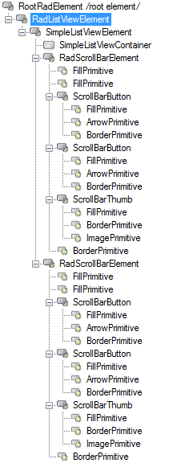
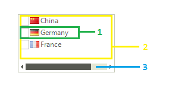
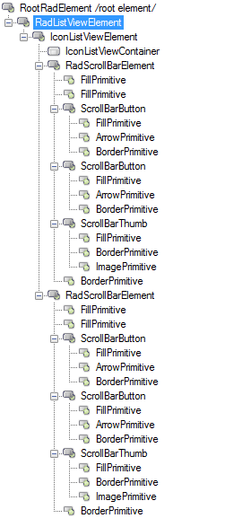
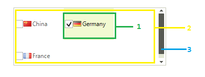
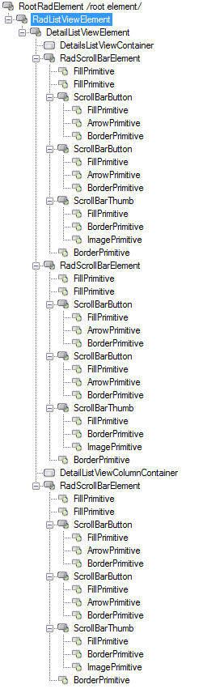
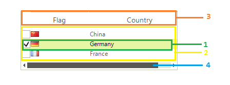

This article will show the internal elements structure of __RadCheckedListBox__ considering the __ListViewType__:

# Structure of ListViewType.ListView

>caption Figure 1: ListViewType.ListView's elements hierarchy

>caption Figure 2: RadCheckedListBox's structure in ListViewType.ListView

1. __SimpleListViewVisualItem__: represents the visual item.  
	1\.1\. __ListViewItemCheckbox__: represents the check box.
2. __SimpleListViewContainer__: represents the view container.
3. __RadScrollBarElement__: represents the scroll bar.

# Structure of ListViewType.IconsView

>caption Figure 3: ListViewType.IconsView's elements hierarchy

>caption Figure 4: RadCheckedListBox's structure in ListViewType.IconsView

1. __IconListViewVisualItem__: represents the visual item.  
	1\.1\. __ListViewItemCheckbox__: represents the check box.
2. __IconListViewContainer__: represents the view container.
3. __RadScrollBarElement__: represents the scroll bar.

# Structure of ListViewType.DetailsView

>caption Figure 5: RadCheckedListBox's structure in ListViewType.DetailsView

>caption Figure 6: RadCheckedListBox's structure in ListViewType.DetailsView

1. __DetailListViewVisualItem__: represents the visual item.  
	1\.1\. __ListViewItemCheckbox__: represents the check box. 
	1\.2\. __DetailListViewColumnContainer__: represents the column container that holds the cells.  
		1\.2\.1\. __DetailListViewDataCellElement__: represents the cell. 
2. __DetailsListViewContainer__: represents the view container.
3. __DetailListViewColumnContainer__: represents the container that holds the columns.
4. __RadScrollBarElement__: represents the scroll bar.
