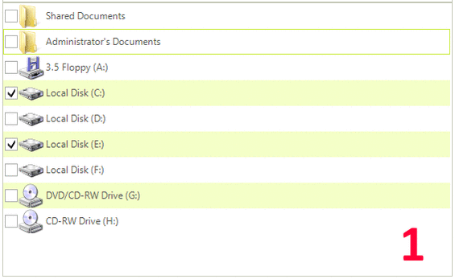

## Using the Space Bar

The space bar allows you to toggle selected items check state with a single hit. Pressing space bar selects current item if it is not selected. When current item is selected and the space bar key is pressed there are two cases:
        

* Toggle selected items, if all items CheckStates are equal.

* Check selected items, if at least one item has different CheckState. 

1. Initially there are three selected items and another one is focused.

1. Selects the focused item.

1. Checks all selected items (that's why selected items has different CheckState).

1. Toggles selected items CheckState.