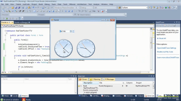

# Clock

__RadClock__ is a control which allows the developers to use it in their applications to display time to the users. 





>note The control cannot be resized since it uses a bitmap for its background.
>

| RELATED VIDEOS |  |
| ------ | ------ |
|[Getting Started with RadTimePicker and RadClock for WinForms](http://tv.telerik.com/watch/winforms/getting-started-with-radtimepicker-for-winforms) In this video, we are going to demonstrate the new RadTimePicker and RadClock controls as well as several properties you should be aware of.||

# See Also

* [Structure]()
* [Getting Started]()
