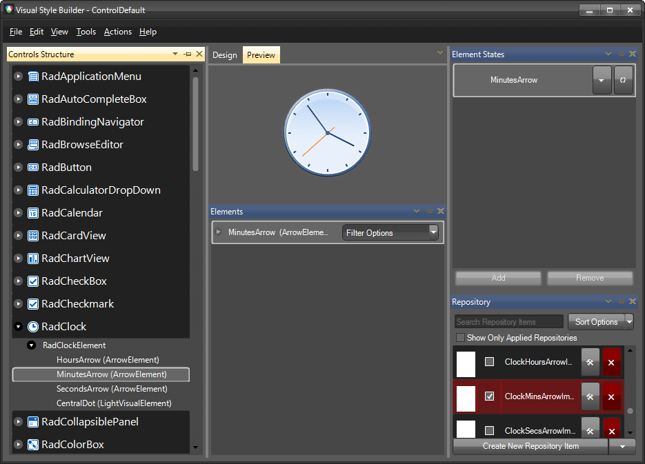
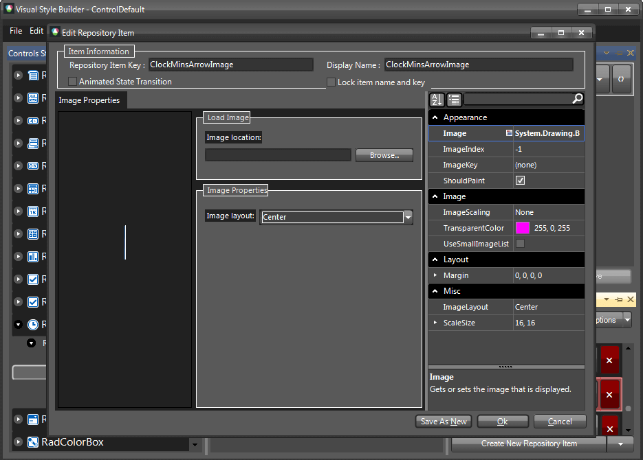

  
# Themes

This help article will demonstrate a step by step tutorial how to customize the ControlDefault theme for __RadClock__ 

1. Open [VisualStyleBuilder]().

1. Export the built-in themes in a specific folder by selecting *File >> Export Built-in Themes*.

1. Load a desired theme from the just exported files by selecting *File >> Open Package*

1. Select RadClockElement.__MinutesArrow__ in *Controls Structure* on the left side. Then, select __MinutesArrow__ in the *Elements* section.

	

1. Modify the applied *image* repository item. 

	

1. Save the theme by selecting *File >> Save As*.

1. Now, you can apply your custom theme to __RadClock__ by using the demonstrated approach in the following link: [Using custom themes]()
