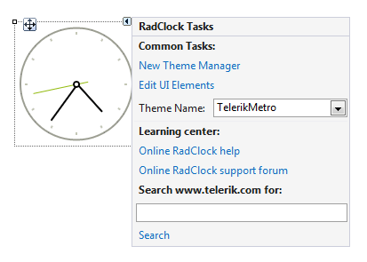

# Design Time

## Smart Tag

>caption Fig.1 Smart Tag

* __Common Tasks__

	* __New Theme Manager__: Adds a new __RadThemeManager__ component to the form.

	* __Edit UI elements__: Opens a dialog that displays the *Element Hierarchy Editor*. This editor lets you browse all the elements in the control.

	* __Theme Name__: Select a theme name from the drop down list of themes available for that control. Selecting a theme allows you to change all aspects of the controls visual style at one time.

* __Learning Center__: Navigate to the Telerik help, code library projects or support forum.

* __Search__: Search the Telerik site for a given string.

# See Also

* [Element Hierarchy Editor]()
