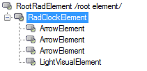
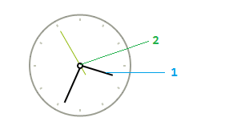

# Structure

>caption Fig.1 RadClock's elements hierarchy

1. __ArrowElement__: represents the seconds, minutes and hours arrows.
2. __LightVisualElement__: represents the central dot. 

>caption Fig.2 RadClock's structure

# See Also

* [Design Time]()
* [Getting Started]()

