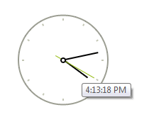
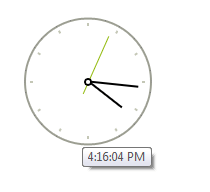

# Tooltips

There are two ways to assign tooltips to __RadClock__, namely setting the __ToolTipText__ property of the __RadClockElement__, or as in most of the RadControls by using the __ToolTipTextNeeded__ event of __RadClock__. It is necessary the __ShowItemToolTips__ property to be set to *true* which is the default value.

#### Setting the ToolTipText property

{{source=..\SamplesCS\Clock\ClockGettingStarted.cs region=SetToolTipText}} 
{{source=..\SamplesVB\Clock\ClockGettingStarted.vb region=SetToolTipText}}

````C#
radClock1.ClockElement.ToolTipText = DateTime.Now.ToLongTimeString();

````
````VB.NET
radClock1.ClockElement.ToolTipText = DateTime.Now.ToLongTimeString()

````

{{endregion}} 



#### Setting tool tips in the ToolTipTextNeeded event

{{source=..\SamplesCS\Clock\ClockGettingStarted.cs region=ToolTipTextNeeded}} 
{{source=..\SamplesVB\Clock\ClockGettingStarted.vb region=ToolTipTextNeeded}}

````C#
private void RadClock1_ToolTipTextNeeded(object sender, Telerik.WinControls.ToolTipTextNeededEventArgs e)
{
    e.ToolTipText = DateTime.Now.ToLongTimeString();
}

````
````VB.NET
Private Sub RadClock1_ToolTipTextNeeded(sender As Object, e As Telerik.WinControls.ToolTipTextNeededEventArgs)
    e.ToolTipText = DateTime.Now.ToLongTimeString()
End Sub

````

{{endregion}} 



>note The __ToolTipTextNeeded__ event has higher priority and overrides the tool tips set in  the __ToolTipText__ property.


 


