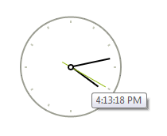
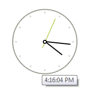

# Tooltips

There are two ways to assign tooltips to __RadClock__, namely setting the __ToolTipText__ property of the __RadClockElement__, or as in most of the RadControls by using the __ToolTipTextNeeded__ event of __RadClock__. It is necessary the __ShowItemToolTips__ property to be set to *true* which is the default value.

#### Setting the ToolTipText property

<snippet id='clock-tooltips-settoolTiptext-cs'/>
<snippet id='clock-tooltips-settoolTiptext-vb'/>

 

#### Setting tool tips in the ToolTipTextNeeded event

<snippet id='clock-tooltips-tooltiptextneeded-cs'/>
<snippet id='clock-tooltips-tooltiptextneeded-vb'/>

 

>note The __ToolTipTextNeeded__ event has higher priority and overrides the tool tips set in  the __ToolTipText__ property.

 

