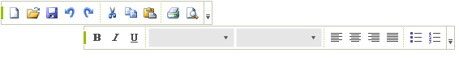
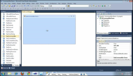
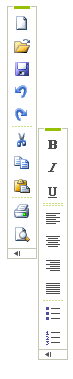

# WinForms CommandBar Overview

__RadCommandBar__ is a fully themeable tool strip that provides unprecedented flexibility. More than just a collection of buttons, __RadCommandBar__ hosts any RadControl, including combo boxes, text boxes, split buttons, drop-down buttons, toggle buttons and more. CommandBar can be moved, rearranged and resized at run time for easy end-user customization. __RadCommandBar__ can be styled to match any user interface using a predefined theme or a theme you design yourself using the Visual Style Builder. 





| RELATED VIDEOS |  |
| ------ | ------ |
|[WinForms RadCommandBar Working with RadCommandBar](http://www.telerik.com/videos/winforms/working-with-radcommandbar-for-winforms) In this video, you will learn how to create and add RadCommandBars to your applications.||

## Orientation

__RadCommandBar__ supports horizontal and vertical orientation:

## Theming

The appearance of the __RadCommandBar__, containers and tool items can be tailored using one of the predefined themes, altering an existing theme in the Visual Style Builder, or by building your own custom themes with Visual Style Builder. Visual Style Builder lets you alter the look and feel of the tool strip and of each individual item in the tool strip, including dynamically changing properties using the new Visual Style Builder animation capabilities.
        
## Overflow Handling

The overflow button automatically displays items that don't have the real estate to display by default. The end user can also customize the toolstrip by adding and removing buttons.
        
## Telerik UI for WinForms Learning Resources
* [Telerik UI for WinForms CommandBar Homepage](https://www.telerik.com/products/winforms/commandbar.aspx)
* [Get Started with the Telerik UI for WinForms CommandBar]()
* [Telerik UI for WinForms API Reference](https://docs.telerik.com/devtools/winforms/api/)
* [Getting Started with Telerik UI for WinForms Components]()
* [Telerik UI for WinForms Virtual Classroom (Training Courses for Registered Users)](https://learn.telerik.com/learn/course/external/view/elearning/17/TelerikUIforWinForms) 
* [Telerik UI for WinForms Forum](https://www.telerik.com/forums/winforms)
* [Telerik UI for WinForms Knowledge Base](https://docs.telerik.com/devtools/winforms/knowledge-base)