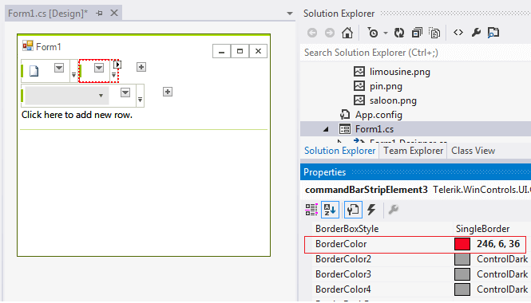

## Design time

You can access and modify the style for different elements in __RadCommandBar__ by selecting the element and customizing its look by the *Properties* section in Visual Studio 

>caption Fig.1 Customizing CommandBarStripElement's border at design time.



## Programmatically

You can customize the elements at run time as well:
>caption Fig.2 Customize elements


#### Customize elements at run time

{{source=..\SamplesCS\CommandBar\FloatingStrips.cs region=AccessingCustomizingElements}} 
{{source=..\SamplesVB\CommandBar\FloatingStrips.vb region=AccessingCustomizingElements}} 

````C#
this.radCommandBar1.Rows[0].BackColor = Color.Lime;
this.radCommandBar1.Rows[0].DrawFill = true;
this.radCommandBar1.Rows[0].GradientStyle = Telerik.WinControls.GradientStyles.Solid;
this.radCommandBar1.Rows[0].Strips[0].BackColor = Color.Yellow;
this.radCommandBar1.Rows[0].Strips[0].BorderColor = Color.Red;

````
````VB.NET
Me.RadCommandBar1.Rows(0).BackColor = Color.Lime
Me.RadCommandBar1.Rows(0).DrawFill = True
Me.RadCommandBar1.Rows(0).GradientStyle = Telerik.WinControls.GradientStyles.Solid
Me.RadCommandBar1.Rows(0).Strips(0).BackColor = Color.Yellow
Me.RadCommandBar1.Rows(0).Strips(0).BorderColor = Color.Red

````

{{endregion}} 
 
