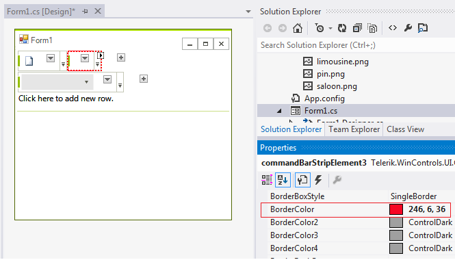
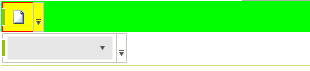

# Design time

You can access and modify the style for different elements in __RadCommandBar__ by selecting the element and customizing its look by the *Properties* section in Visual Studio 

>caption Figure 1: Customizing CommandBarStripElement's border at design time.

## Programmatically

You can customize the elements at run time as well:
>caption Figure 2: Customize elements

#### Customize elements at run time

<snippet id='commandbar-accessing-and-customizing-elements-accessingcustomizingelements-cs'/>
<snippet id='commandbar-accessing-and-customizing-elements-accessingcustomizingelements-vb'/>

 
